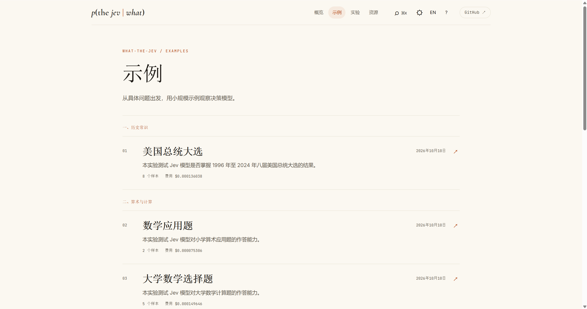
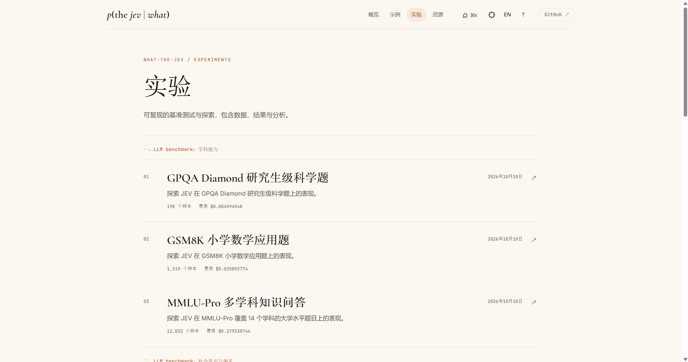

# what-the-jev?!


*[English](README.md) | 简体中文*

在线站点：[English](https://keta1930.github.io/what-the-jev/) | [简体中文](https://keta1930.github.io/what-the-jev/zh/)。

## 项目简介

**what-the-jev** 展示 Jev（TypeSafe AI 的 System One 决策模型）在各种任务上的能力。本项目提供一套稳定的 Jev 实验框架，支持大规模、可复现的任务运行。我们基于这套框架开展实验并提供可复现的结果与分析报告。其中，[`example/`](example/) 提供便于上手的轻量级示例，[`experiments/`](experiments/) 提供覆盖不同任务的完整实验及配套分析报告，[`resource/`](resource/) 整理 Jev 相关模型、工具与应用资源。如果你刚接触或想深入探索 Jev，本项目是一个不错的起点。

## 一些实验发现

- **为 Agent 选择合适的技能：** 我们用 126 个真实 Agent 技能测试 Jev 能否根据用户请求选对技能，或判断无需使用技能。250 个任务各提供正式与口语两种说法，共 500 条提示，Jev **答对了 488 条（97.6%）**。需要多个技能的任务，从预先给出的技能组合中选择。[查看技能路由实验](experiments/skill-routing/report/REPORT.zh.md)。
- **回答研究生难度的科学题：** 我们用 GPQA Diamond 的 198 道生物、物理和化学选择题测试 Jev，每题从四个选项中选出答案。Jev **答对了 150 道（75.76%）**。[查看科学题实验](experiments/gpqa-diamond/report/REPORT.zh.md)。
- **比较两个社区的房价：** 在波士顿房价实验中，给 Jev 两个社区的信息，让它判断哪个社区房价更高，准确率为 **88.2%**。但让它估计一个社区的房价范围时，按它给出的评分推算价格范围，准确率只有 **9.7%**；直接选择它认为最可能的价格范围，准确率也只有 **31.4%**。[查看房价实验](experiments/boston-housing/report/REPORT.zh.md)。

## 仓库结构

```text
what-the-jev/
├── example/                            轻量级示例
│   ├── us-election/                    【历史常识】测试JEV模型能否回忆 1996 至 2024 年八届美国总统大选的胜选者。
│   ├── math-word-problem/              【算术与计算】测试JEV模型在小学算术应用题上的表现。
│   ├── university-math/                【算术与计算】测试JEV模型在微积分、线性代数与概率计算题上的表现。
│   ├── pixel-recognition/              【图像识别】测试JEV模型能否仅凭像素数值识别图像内容。
│   ├── ethics-dilemmas/                【伦理决策】测试JEV模型在经典伦理困境中的行为可接受性判断。
│   ├── prompt-injection-detection/     【安全】测试JEV模型能否发现多轮 agent 对话中藏在工具调用结果里的提示词注入攻击。
│   ├── paper-qa/                       【论文阅读】测试JEV模型能否根据论文的部分内容回答关于该论文的问题。
│   └── ticket-triage/                  【业务决策】测试JEV模型对客服工单的分类、退款诉求与紧急程度判断。
├── experiments/                        专业级实验
│   ├── gpqa-diamond/                   【benchmark】探索 JEV 在 GPQA Diamond 研究生级科学题上的表现。
│   ├── gsm8k/                          【benchmark】探索 JEV 在 GSM8K 小学数学应用题上的表现。
│   ├── mmlu-pro/                       【benchmark】探索 JEV 在 MMLU-Pro 覆盖 14 个学科的大学水平题目上的表现。
│   ├── bbq/                            【benchmark】探索 JEV 在 BBQ 偏见敏感问答题上的表现，以及是否会偏向刻板印象。
│   ├── socialiqa/                      【benchmark】探索 JEV 在 SocialIQA 社会常识题上的表现。
│   ├── paper-classification/           【论文分类】探索 JEV 能否按研究偏好判断一篇 arXiv 论文该不该收入论文库，并归入正确的主题。
│   ├── paper-qa/                       【论文问答】探索 JEV 能否基于原文回答关于该论文的问题。
│   ├── prompt-routing/                 【提示词路由】探索 JEV 能否仅凭提问文本，判断提问该走 JEV 快路径还是 LLM 慢路径。
│   ├── skill-routing/                  【技能路由】探索 JEV 能否把用户任务路由到 126 个真实 Agent Skill 中的正确技能、技能组合或 none。
│   ├── boston-housing/                 【数值回归】探索 JEV 能否预测波士顿社区的房价，并比较不同社区的房价高低。
│   ├── titanic/                        【分类预测】探索 JEV 能否根据乘客记录预测乘客是否生还，并比较结构化字段与自然语言文本两种输入下的表现。
│   ├── dpo-jev-judge/                  【大模型训练】探索 JEV 在 DPO 训练数据偏好标注上的表现。
│   └── grpo-jev-judge/                 【大模型训练】探索 JEV 在 GRPO 轨迹奖励分配上的表现。
├── resource/                           Jev 相关项目与模型的收录清单
│   ├── closed-source-models/           【闭源模型】Jev 本体与闭源竞品
│   ├── open-source-models/             【开源模型】开放权重决策模型与复刻
│   ├── use-cases/                      【使用案例】用 Jev 构建的应用
│   ├── integrations/                   【平台与集成】提供 Jev 接入的网关与框架
│   ├── tools/                          【工具与 SDK】使用 Jev 的 SDK、MCP 服务器与 CLI
│   └── benchmarks/                     【评测与校准】Jev 及其替代品的独立与官方评测
├── docs/site/                          中英文文档站点
├── docs/jev/                           【AGENT】JEV 知识库
├── src/decision_models/                运行实验的框架
├── schema/                             数据集与结果的 schema
├── tests/                              框架的测试
├── run.py                              命令行入口
├── AGENTS.md                           【AGENT】项目执行指令
└── .claude/rules/                      【AGENT】项目执行规范
```

**轻量级示例**

- 完整索引：[example/INDEX.zh.md](example/INDEX.zh.md)
- 在线站点：[示例页](https://keta1930.github.io/what-the-jev/zh/examples/)



**实验**

- 完整索引：[experiments/INDEX.zh.md](experiments/INDEX.zh.md)
- 在线站点：[实验页](https://keta1930.github.io/what-the-jev/zh/experiments/)



**资源库**

- 完整索引：[resource/README.zh.md](resource/README.zh.md)
- 在线站点：[资源页](https://keta1930.github.io/what-the-jev/zh/resources/)


## 从这里开始

您可以让AGENT克隆本项目：`git clone --depth 1 https://github.com/keta1930/what-the-jev.git`，复制下面任一提示词，开始探索或运行实验。

```text
1. 了解 Jev 能做什么

介绍这个项目已经探索了 Jev 的哪些能力、发现了哪些局限，并推荐三个适合入门的示例或实验。

2. 跑通第一个示例

帮我运行 example/ticket-triage 工单分诊示例。检查运行环境和 API 配置，告诉我需要补充什么；运行完成后，解释模型的回答、结果文件和调用费用。

3. 验证自己的任务

我想用 Jev 完成：[描述你的任务]。

寻找仓库中可参考的示例、实验和资源。使用现有框架，按仓库规范设计一个实验，先用少量样本验证，并提供可复现的实验与分析报告，说明效果、费用和局限。
```

实验结果以 JSONL 格式保存。为了方便在 VS Code 中阅读，项目作者还提供了 [JSONL Native Reader](https://github.com/keta1930/jsonl-native-reader) 插件，可将 JSONL 展示为格式化的 JSON 数组。VS Code 插件市场搜索名称：**JSONL Native Reader**。

## 路线图

我们将持续拓展决策模型的应用场景，并完善实验框架与交互体验：

- **扩展示例与实验**：持续增加 `example/` 和 `experiments/`，探索决策模型在研究与商业场景中的使用方式，提供可复现的实验、结果与分析报告。
- **建设可交互的 game**：在 `game/` 中开发自带前端的交互式实验，每个实验都支持过程回放，让决策过程更直观，也更有可玩性。该板块目前尚未实施。
- **持续更新资源库**：维护 `resource/`，跟进决策模型相关的模型、工具、集成、应用与评测资源。
- **增强实验基础设施**：完善模型接入与注册机制，支持更多开源决策模型在统一框架下运行实验，便于复现、分析与比较。

具体任务与进度见 [路线图 Issue #7](https://github.com/keta1930/what-the-jev/issues/7)，欢迎参与讨论与贡献。

## 欢迎贡献

我们的目标是打造一个完全由开源精神驱动的决策模型社区，探索决策模型的使用场景与能力边界。

我们非常欢迎任何贡献，包括代码、纠错、提供实验或示例、添加资源等。

期待您的 PR。

## Citation

引用本仓库：

```bibtex
@software{what_the_jev,
  author = {{what-the-jev contributors}},
  title = {what-the-jev: Decision-model use cases and capability boundaries},
  url = {https://github.com/keta1930/what-the-jev},
  license = {MIT}
}
```

## 联系方式

📧 Email: yandeheng1@gmail.com

## 许可证

[MIT](LICENSE)
