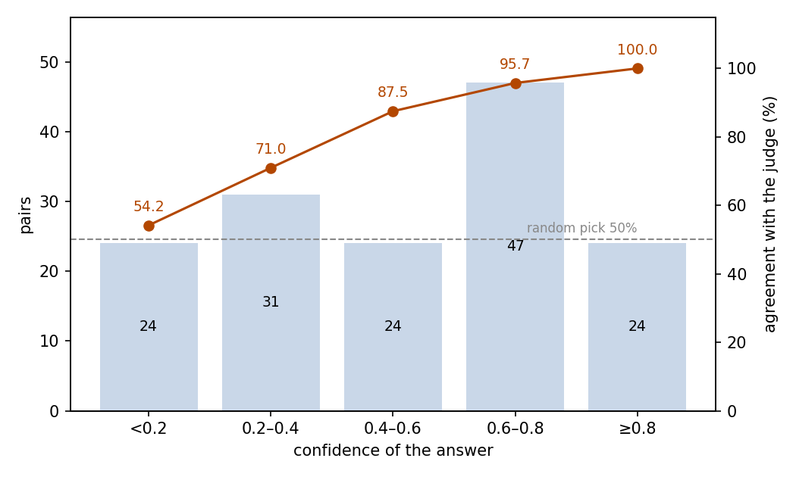

# Judging DPO Preference Pairs: JEV Picking the Better of Two Thinking Traces

## Abstract

This experiment tests whether JEV can reproduce an LLM judge's preference between two thinking traces. The setting is 150 open-ended reasoning questions; each pair consists of the judge's winning trace and one random loser from the same question, and JEV picks the better one. JEV agreed with the judge on 83.3% of the pairs (95% CI 76.6–88.4%), far above the 50% random level, with no position bias: agreement is close on both sides (82.9% when the winning trace is at A, 83.8% at B). Confidence separates trustworthy judgments from unreliable ones: the 24 pairs at confidence ≥0.8 contain zero errors, while agreement on the 24 pairs below 0.2 drops markedly (54.2%). An alternative layout that moves the candidate texts into the criteria drops agreement to 79.3%. The standard-layout run consumed 359,825 input tokens and 4,650 output tokens, costing $0.0151. We conclude that for labeling preference pairs, JEV's two-way pick can be used directly, with confidence as a screen.

## 1 Purpose

This experiment measures JEV's ability to judge thinking quality in pairs: given two thinking traces answering the same question, pick the better one. The scenario comes from DPO-style training, which consumes chosen/rejected preference pairs; the labeling step is exactly this two-way pick. A DeepSeek LLM judge defined the winning trace of each pair, and we ask whether JEV reproduces the judge's preference.

### Relation to grpo-jev-judge

The pairs are drawn from the upstream data of grpo-jev-judge: the same 150 questions, the same eight rollouts per question, and the same judge winners (see experiments/grpo-jev-judge/report/REPORT.md). Each pair here joins one judge winner with one random loser from the same eight traces. The two experiments measure the same judging ability in two forms: pairwise choice here, and eight-way choice within a group, where the hit rate is 45.3%.

## 2 Dataset

The dataset holds 150 preference pairs, one per open-ended Chinese reasoning question. The two traces in a pair come from the question's eight Qwen3-0.6B rollouts: the chosen side is the DeepSeek judge's winner, the rejected side is one random trace from the remaining seven. Which trace is placed at option A is decided per pair by a random draw, ending with the winning trace at A in 76 pairs and at B in 74. The option holding the winning trace is the reference answer, and JEV judges by the same written quality standard the judge used.

Questions fall into three types by form: causal explanation, cause finding, and trade-off advice, 50 each. This analysis derives the division from the id prefix (g-causal, g-diagnosis, g-tradeoff); the samples carry no original type labels.

Each pair is posed in two layouts. In the standard layout, the two traces are placed in `state.responses` and the criteria are pointers to them; in the criteria-text layout, the trace texts themselves serve as the criteria and the state keeps only the question.

## 3 A Minimal Example

This section shows one real pair in both layouts, for side-by-side comparison. Under the standard layout, the input sent to the model (the model field is omitted; the original text is Chinese and is translated here):

```json
{
  "state": {
    "prompt": "A colleague left a handover document before departing, yet the person who took over still makes frequent mistakes while following it. Explain why errors persist even with a documented handover.",
    "responses": {
      "A": "Well, the user asks: a colleague left a handover document when departing, yet the successor still makes frequent mistakes while following it; I need to explain why errors persist even with a handover document. First, let me identify the core of the question: they want to know the possible reasons the successor still errs despite the document. …",
      "B": "Hmm, let me think about this situation. After the employee left, the successor follows the handover document but still makes frequent mistakes. Why is that? First, the document may not be detailed or accurate enough, or some information may be missing. …"
    }
  },
  "questions": {
    "better": {
      "type": "choice",
      "instructions": "1. Task\nPick the thinking trace with the better quality from responses.A and responses.B.\n… (the remaining six sections omitted)",
      "criteria": {"A": "responses.A", "B": "responses.B"}
    }
  }
}
```

The model's output (key fields only):

```json
{
  "answers": {
    "better": {
      "type": "choice",
      "choice": "A",
      "probabilities": {"A": 0.74, "B": 0.26},
      "confidence": 0.48
    }
  },
  "usage": {"input_tokens": 2177, "output_tokens": 31, "cost": 0.0000914}
}
```

JEV chose A, the trace the LLM judge preferred.

In the criteria-text layout, the state keeps only the question and the trace texts themselves serve as the criteria; the instructions are unchanged:

```json
{
  "state": {
    "prompt": "A colleague left a handover document before departing, yet the person who took over still makes frequent mistakes while following it. Explain why errors persist even with a documented handover."
  },
  "questions": {
    "better": {
      "type": "choice",
      "instructions": "1. Task\nPick the thinking trace with the better quality from responses.A and responses.B.\n… (the remaining six sections omitted)",
      "criteria": {
        "A": "Well, the user asks: a colleague left a handover document when departing, yet the successor still makes frequent mistakes while following it; I need to explain why errors persist even with a handover document. …",
        "B": "Hmm, let me think about this situation. After the employee left, the successor follows the handover document but still makes frequent mistakes. …"
      }
    }
  }
}
```

The model's output (key fields only):

```json
{
  "answers": {
    "better": {
      "type": "choice",
      "choice": "A",
      "probabilities": {"A": 0.7, "B": 0.3},
      "confidence": 0.39
    }
  },
  "usage": {"input_tokens": 2153, "output_tokens": 31, "cost": 0.0000904}
}
```

JEV again chose A, but its confidence dropped from 0.48 in the standard layout to 0.39.

## 4 Results

### Overall

All 150 pairs received a valid answer; no call failed. The criterion is the DeepSeek LLM judge's preference: the questions are open-ended with no single right answer, so this measures agreement with that judge, not correctness. JEV agreed on 125 pairs, an agreement rate of 83.3% with a 95% confidence interval of 76.6–88.4%; a random pick between two options agrees 50% of the time.

### By question type

Agreement is flat across the three question types:

| Question type | Pairs | Agreements | Agreement rate |
| --- | ---: | ---: | ---: |
| causal explanation | 50 | 42 | 84.0% |
| cause finding | 50 | 41 | 82.0% |
| trade-off advice | 50 | 42 | 84.0% |

### Confidence and agreement

JEV reports a confidence with each answer. Agreement rises monotonically with confidence, from near-random at the bottom to no error at the top (Figure 1):

| Confidence | Pairs | Share | Agreement |
| --- | ---: | ---: | ---: |
| < 0.2 | 24 | 16.0% | 54.2% |
| 0.2–0.4 | 31 | 20.7% | 71.0% |
| 0.4–0.6 | 24 | 16.0% | 87.5% |
| 0.6–0.8 | 47 | 31.3% | 95.7% |
| ≥ 0.8 | 24 | 16.0% | 100% |



Figure 1: agreement rises monotonically with confidence; the top bin makes no error, the bottom bin remains near the 50% random level marked by the dashed line.

The two groups differ markedly: the mean confidence is 0.559 on agreements and 0.257 on disagreements. A threshold at 0.8 keeps 24 pairs (16.0%) at zero errors.

### Behavior

JEV's picks split exactly 75 to 75 between A and B, and agreement is even on both sides: 82.9% when the winning trace is at A, 83.8% at B. Every answer's probabilities sum to 1, and the chosen option carries the highest probability.

### Cost

The standard-layout run consumed 359,825 input tokens and 4,650 output tokens, for a total cost of $0.0151.

### Layout ablation

The two layouts differ in where the candidate texts are stored. Moving them into the criteria lowers agreement by about four points (the two intervals overlap) and tilts JEV toward A (60.7% versus 50.0%); it also compresses confidence overall, so a 0.8 threshold selects 1 pair instead of 24. Lowering the threshold to 0.4 still selects 64 pairs, all of them in agreement:

| Layout | Agreement (95% CI) | A picks | Median confidence | Input tokens | Output tokens | Cost |
| --- | --- | ---: | ---: | ---: | ---: | ---: |
| standard | 83.3% (76.6–88.4%) | 75 (50.0%) | 0.55 | 359,825 | 4,650 | $0.0151 |
| criteria-text | 79.3% (72.2–85.0%) | 91 (60.7%) | 0.32 | 356,225 | 4,650 | $0.0150 |

Under criteria-text, JEV picks A in 60.7% of the pairs; agreement reaches 89.5% when the winning trace is at A but falls to 68.9% at B. Confidence is compressed as well: only one pair reaches 0.8 or above, against 24 in the standard layout, and lowering the threshold to 0.4 still leaves 64 criteria-text pairs, all in agreement.

## 5 Conclusion

In pair form, JEV reproduces the LLM judge's preference on about five pairs out of six, and agreement is close whether the winning trace sits at A or B, with no lean toward either side. High-confidence judgments rarely err, while low-confidence ones are markedly less reliable. Pairwise choice lets that judging ability work reliably: label preference pairs with it directly, gate on confidence, and route the low-confidence tail to review. The standard layout gives more balanced picks and higher confidence, so this experiment treats it as the default.

## Related Resources

- DPO paper: https://arxiv.org/abs/2305.18290
- Qwen3-0.6B (rollout model): https://huggingface.co/Qwen/Qwen3-0.6B
- DeepSeek API documentation (LLM judge): https://api-docs.deepseek.com/
