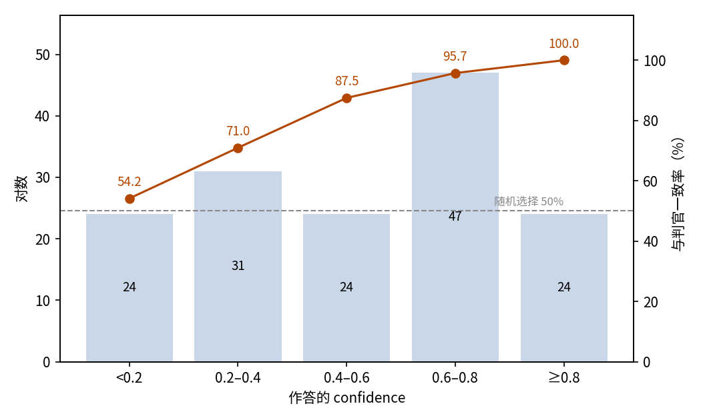

# DPO 偏好对判优：JEV 二选一并对照 LLM 判官

## 摘要

本实验测试 JEV 能否复现 LLM 判官在两条思考之间的偏好。场景是 150 道开放式推理题的偏好对：每对由判官赢家与同题随机一条落选思考组成，JEV 二选一。JEV 与判官的一致率为 83.3%（95% 置信区间 76.6%–88.4%），远高于 50% 的随机水平，且无位置偏好：选 A 与选 B 恰好各 75 次。confidence 能把可信判断与抛硬币分开：不低于 0.8 的 24 对零错误，低于 0.2 的 24 对接近随机水平。把候选文本挪进 criteria 的变体布局一致率降至 79.3%。标准布局消耗输入 359,825 token、输出 4,650 token，总费用 0.0151 美元。结论是二选一形态下 JEV 可直接承担偏好对标注，confidence 是可用的信任开关。

## 1 实验目的

本实验测 JEV 的成对判优能力：在同一题目的两条思考中选出质量更好的一条。这个场景来自 DPO 类训练所需的偏好对标注——每对要定出 chosen 与 rejected，标注动作正是这次二选一。每对的优胜侧由 DeepSeek LLM 判官的选择定义，本实验看 JEV 能否复现判官的偏好。

### 与 grpo-jev-judge 的关系

本实验的偏好对构建自 grpo-jev-judge 的上游数据：同样的 150 道题、每题同样的八条 rollout、同一个判官赢家（见 experiments/grpo-jev-judge/report/REPORT.md）。每对由判官赢家加同题八条中随机一条落选思考组成。两个实验测同一种判优能力的两个形态：成对二选一（本实验）与组内八选一（后者命中率 45.3%）。

## 2 数据集

数据集包含 150 个偏好对，每道中文开放式推理题一个。对中两条思考来自该题的八条 Qwen3-0.6B rollout：chosen 侧是 DeepSeek 判官选出的赢家，rejected 侧是其余七条中随机一条。优胜侧放在 A 还是 B 由逐对抛硬币决定，最终 76 对的优胜侧在 A、74 对在 B。优胜侧位置即参考答案；JEV 使用与判官相同的书面质量标准作答。

题目按形式分三类：现象解释、原因排查、权衡建议，各 50 道。这一划分由本次分析从 id 前缀（g-causal、g-diagnosis、g-tradeoff）恢复，不是样本的原始标签。

每个偏好对以两种布局呈现。标准布局把两条思考放在 `state.responses`，criteria 只放指向它们的指针；criteria-text 布局把思考文本直接作为 criteria，state 只留题目。

## 3 最小示例

本节取数据集中的一对，展示一次完整的输入与输出（标准布局）。发给模型的输入如下（省略 model 字段）：

```json
{
  "state": {
    "prompt": "一位同事离职前留下一份交接文档，接手的职员照着文档操作却还是经常出错。请你解释为什么有文档交接仍然会出错。",
    "responses": {
      "A": "嗯，用户的问题是说一个同事离职后留了文档，接手的同事照着操作却还是经常出错，现在需要解释为什么即使有交接文档也会出错。首先，我需要理解用户的问题核心。他们想知道为什么即使有交接文档，接手者还是会出现错误，可能的原因有哪些。……",
      "B": "嗯，让我来想想这个情况。职员离职后，根据交接文档操作，却还是经常出错。那为什么会这样呢？首先，交接文档可能内容不够详细或者不够准确，或者有遗漏的信息。……"
    }
  },
  "questions": {
    "better": {
      "type": "choice",
      "instructions": "一、任务\n从 responses.A 与 responses.B 中选出思维质量更好的一条。\n……（其余六节省略）",
      "criteria": {"A": "responses.A", "B": "responses.B"}
    }
  }
}
```

模型输出如下（仅保留关键字段）：

```json
{
  "answers": {
    "better": {
      "type": "choice",
      "choice": "A",
      "probabilities": {"A": 0.74, "B": 0.26},
      "confidence": 0.48
    }
  },
  "usage": {"input_tokens": 2177, "output_tokens": 31, "cost": 0.0000914}
}
```

JEV 选择了 A，即 LLM 判官偏好的那条。

## 4 结果

### 整体结果

150 对全部获得有效作答，无失败记录。以 DeepSeek LLM 判官的偏好为判据——题目是开放式问题，没有标准答案，测的是与判官的一致性而非正确性——JEV 一致 125 对，一致率 83.3%，95% 置信区间 76.6%–88.4%。二选一随机作答的一致率为 50%。

### 按题型分组

三类题型的一致率基本持平：

| 题型 | 对数 | 一致 | 一致率 |
| --- | ---: | ---: | ---: |
| 现象解释 | 50 | 42 | 84.0% |
| 原因排查 | 50 | 41 | 82.0% |
| 权衡建议 | 50 | 42 | 84.0% |

### 置信关系

JEV 对每对报告一个 confidence。一致率随 confidence 单调上升，从最低档的接近随机到最高档的全对（图 1）：

| Confidence | 对数 | 占比 | 一致率 |
| --- | ---: | ---: | ---: |
| < 0.2 | 24 | 16.0% | 54.2% |
| 0.2–0.4 | 31 | 20.7% | 71.0% |
| 0.4–0.6 | 24 | 16.0% | 87.5% |
| 0.6–0.8 | 47 | 31.3% | 95.7% |
| ≥ 0.8 | 24 | 16.0% | 100% |



图 1：一致率随 confidence 单调上升；最高档零错误，最低档接近虚线标出的 50% 随机水平。

区分度很大：一致作答的 confidence 均值 0.559，不一致者 0.257。按 0.8 设阈可保留 24 对（16.0%）且零错误。

### 行为统计

JEV 选 A 与选 B 恰好各 75 次；判官偏好落在 A 时一致率 82.9%，落在 B 时 83.8%，两侧对称。全部作答的概率合计均为 1，且所选项均为概率最高的选项。

### 调用成本

标准布局共消耗输入 359,825 token、输出 4,650 token，总费用 0.0151 美元。

### 布局消融

两种布局只差候选文本的位置。把文本挪进 criteria 损失四个百分点的一致率，引入首选项偏好，并压低 confidence 直至信任开关失效：

| 布局 | 一致率（95% 置信区间） | 选 A 次数 | confidence 中位数 | 输入 token | 输出 token | 费用 |
| --- | --- | ---: | ---: | ---: | ---: | ---: |
| 标准布局 | 83.3%（76.6%–88.4%） | 75（50.0%） | 0.56 | 359,825 | 4,650 | 0.0151 美元 |
| criteria-text | 79.3%（72.2%–85.0%） | 91（60.7%） | 0.32 | 356,225 | 4,650 | 0.0150 美元 |

criteria-text 布局下 JEV 有 60.7% 的作答选 A；判官偏好落在 A 时一致率 89.5%，落在 B 时只有 68.9%。confidence 被压低到只有 1 对不低于 0.8，而标准布局有 24 对。

## 5 结论

成对形态下，JEV 在六对中约五对复现 LLM 判官的偏好，没有位置偏好，confidence 能把可采信的判断与抛硬币干净地分开。二选一是 JEV 判官能力可靠落地的形态：直接标注偏好对，按 confidence 设闸，把低 confidence 的尾部转交复核。criteria-text 布局在每个维度上都更差，这个任务不应使用。

## 6 洞察

1. 成对判优是 JEV 判官能力的可靠形态：一致率高且无位置偏好，可直接承担偏好对标注。
2. 二选一中 confidence 可直接用作信任开关：高 confidence 免复核，最低档接近抛硬币，优先转交复核。
3. 候选文本应留在 state 里、由 criteria 指针引用：挪进 criteria 会引入首选项偏好并毁掉 confidence 的区分度。
4. 题型对二选一一致率几乎没有影响，这个任务不必按题型分设阈值。

## 相关资料

- DPO 论文：https://arxiv.org/abs/2305.18290
- Qwen3-0.6B（rollout 模型）：https://huggingface.co/Qwen/Qwen3-0.6B
- DeepSeek API 文档（LLM 判官）：https://api-docs.deepseek.com/
