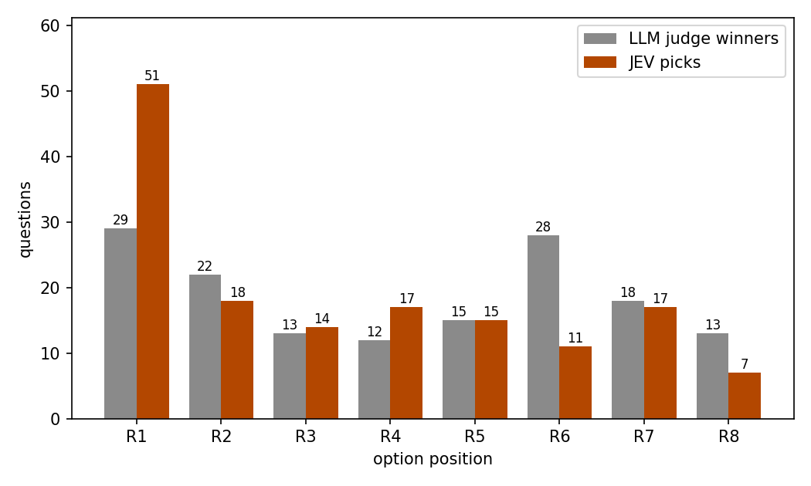
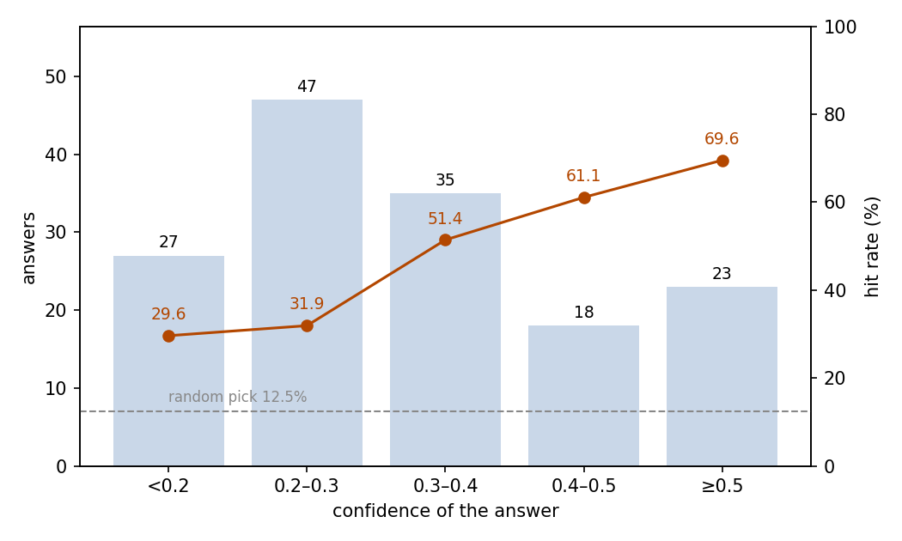

# Judging GRPO Rollouts: JEV Picking the Best of Eight Thinking Traces

## Abstract

This experiment tests whether JEV can identify the best thinking trace the way an LLM judge does. The setting is 150 open-ended reasoning questions, each with eight thinking traces sampled from the same model. A DeepSeek LLM judge has picked one winner per question, and JEV must pick the same trace out of eight. JEV matched the judge on 45.3% of the questions (95% CI 37.6–53.3%). That is well above the 12.5% random level, but JEV still misses more than half. Its picks lean toward the first positions: 34.0% fall on R1, while R8 is picked only 7 times. JEV's confidence sorts the answers but never becomes reliable: the mean is 0.377 on hits against 0.285 on misses. Moving the candidate texts into the criteria yields 42.0%. The standard-layout run consumed 1,020,099 input tokens and 12,750 output tokens, costing $0.0428. JEV picks the best of eight better than chance, but the position bias is clear, and it is not yet able to replace the judge and produce labels.

## 1 Purpose

This experiment measures one ability: can JEV pick the best of eight thinking traces that answer the same question? The scenario comes from GRPO-style reinforcement learning: training samples a group of rollouts per question, and the labeling step needs one winner per group, so that step is exactly this eight-way pick. A DeepSeek LLM judge has already made these picks under a written quality standard; we ask whether JEV reproduces them.

### Relation to dpo-jev-judge

The same rollouts and judge choices also feed the pair-level experiment dpo-jev-judge: there, the judge's winner is paired with one random loser from the same eight traces, and JEV picks the better of the two (see experiments/dpo-jev-judge/report/REPORT.md). The two experiments measure the same judging ability at two granularities: eight-choice within a group (this experiment) and two-choice within a pair. In the pair form, agreement reaches 83.3%.

## 2 Dataset

The dataset holds 150 open-ended Chinese reasoning questions about everyday situations. Each question comes with eight thinking traces (R1–R8) that Qwen3-0.6B sampled in thinking mode at temperature 1.0. The traces hold reasoning only, no final conclusion, and their order is the sampling order. A DeepSeek judge picked one winner per question under a written quality standard (no contradictions, complete coverage of the question, followable steps, concrete grounding). That winner is the reference. JEV answers under the same written standard.

Questions fall into three types by form: causal explanation, cause finding, and trade-off advice, 50 each. This analysis recovers the division from the id prefix (g-causal, g-diagnosis, g-tradeoff); the samples carry no original type labels.

Each question is posed in two layouts. In the standard layout, the eight traces sit in `state.responses` and the criteria are pointers to them; in the criteria-text layout, the trace texts themselves serve as the criteria and the state keeps only the question.

## 3 A Minimal Example

This section takes one real question and shows its input and output under both layouts, so the two variants can be compared side by side. The original text is Chinese and is translated here; the model field is omitted. Under the standard layout, the input sent to the model:

```json
{
  "state": {
    "prompt": "A colleague left a handover document before departing, yet the person who took over still makes frequent mistakes while following it. Explain why errors persist even with a documented handover.",
    "responses": {
      "R1": "OK, I need to solve this problem. The user says a colleague left a handover document before departing, and the person taking over ran into problems while following it. The user wants to know why a documented handover can still go wrong. First, let me consider common causes. The document itself may be flawed — incomplete, for example, or poorly worded. …",
      "…": "…R2 to R8 omitted…"
    }
  },
  "questions": {
    "winner_overall": {
      "type": "choice",
      "instructions": "1. Task\nPick the thinking trace with the best quality from responses.R1 to responses.R8.\n… (the remaining six sections omitted)",
      "criteria": {
        "R1": "responses.R1",
        "R2": "responses.R2",
        "…": "…",
        "R8": "responses.R8"
      }
    }
  }
}
```

The model's output (key fields only):

```json
{
  "answers": {
    "winner_overall": {
      "type": "choice",
      "choice": "R5",
      "probabilities": {"R1": 0.07, "R2": 0.21, "R3": 0.09, "R4": 0.12, "R5": 0.43, "R6": 0.02, "R7": 0.04, "R8": 0.02},
      "confidence": 0.35
    }
  },
  "usage": {"input_tokens": 4872, "output_tokens": 85, "cost": 0.000204624}
}
```

JEV chose R5, matching the LLM judge's pick.

Under the criteria-text layout, the same question is posed differently: the state keeps only the question, and the trace texts themselves serve as the criteria.

```json
{
  "state": {
    "prompt": "A colleague left a handover document before departing, yet the person who took over still makes frequent mistakes while following it. Explain why errors persist even with a documented handover."
  },
  "questions": {
    "winner_overall": {
      "type": "choice",
      "instructions": "1. Task\nPick the thinking trace with the best quality from responses.R1 to responses.R8.\n… (the remaining six sections omitted)",
      "criteria": {
        "R1": "OK, I need to solve this problem. The user says a colleague left a handover document before departing, and the person taking over ran into problems while following it. …",
        "…": "…R2 to R8 omitted…"
      }
    }
  }
}
```

The model's output under this layout (key fields only):

```json
{
  "answers": {
    "winner_overall": {
      "type": "choice",
      "choice": "R5",
      "probabilities": {"R1": 0.07, "R2": 0.22, "R3": 0.09, "R4": 0.18, "R5": 0.25, "R6": 0.10, "R7": 0.04, "R8": 0.05},
      "confidence": 0.14
    }
  },
  "usage": {"input_tokens": 4778, "output_tokens": 85, "cost": 0.000200676}
}
```

JEV again chose R5, but its probability spread is flatter and its confidence drops to 0.14.

## 4 Results

### Overall

All 150 questions received a valid answer; none failed. These questions are open-ended with no single right answer, so the criterion is agreement with the DeepSeek LLM judge, not correctness. Against that criterion, JEV matched the judge's winner on 68 questions: a hit rate of 45.3%, with a 95% confidence interval of 37.6–53.3%. A random pick among eight options hits 12.5%.

### By question type

Hit rates are close across the three question types, highest for causal explanation and lowest for trade-off advice:

| Question type | Questions | Hits | Hit rate |
| --- | ---: | ---: | ---: |
| causal explanation | 50 | 27 | 54.0% |
| cause finding | 50 | 21 | 42.0% |
| trade-off advice | 50 | 20 | 40.0% |

### By option position

The judge's winners spread over all eight positions (R1 at 19.3% and R6 at 18.7% are the most frequent), but JEV's picks cluster at the front (Figure 1): 51 picks (34.0%) fall on R1, while R8 is picked only 7 times (4.7%). The bias ties the hit rate to the winner's position: when the judge's winner is R1, JEV hits 21 of 29 (72.4%); when it is R6, only 7 of 28 (25.0%).



Figure 1: the judge's winners spread across positions while JEV's picks cluster on the first position.

### Confidence and hit rate

JEV reports a confidence with each answer. The hit rate rises with confidence, yet answers concentrate at low confidence and even the top bin stays far from reliable (Figure 2):

| Confidence | Answers | Share | Hit rate |
| --- | ---: | ---: | ---: |
| < 0.2 | 27 | 18.0% | 29.6% |
| 0.2–0.3 | 47 | 31.3% | 31.9% |
| 0.3–0.4 | 35 | 23.3% | 51.4% |
| 0.4–0.5 | 18 | 12.0% | 61.1% |
| ≥ 0.5 | 23 | 15.3% | 69.6% |



Figure 2: the hit rate rises with confidence, but answers concentrate at low confidence and no bin reaches a reliable level; the dashed line marks the 12.5% random level.

Confidence sorts the answers but never reaches a level worth trusting: the mean is 0.377 on hits against 0.285 on misses, the median answer carries 0.30, and the highest value seen is 0.81. No cutoff isolates a batch of reliable picks.

### Behavior

Probabilities sum to 1 in 148 answers and to 0.99 in the other 2. In 2 answers (1.3%) the chosen option's probability is strictly below the maximum; in 3 further answers (2.0%) the chosen option ties with others at the maximum, which is not an inconsistency.

### Cost

The standard-layout run consumed 1,020,099 input tokens and 12,750 output tokens, for a total cost of $0.0428.

### Layout ablation

The two layouts differ only in where the candidate texts are placed. Moving them into the criteria costs a little accuracy (the two intervals overlap), weakens the position bias without removing it, and lowers confidence throughout:

| Layout | Hit rate (95% CI) | R1 picks | Median confidence | Input tokens | Output tokens | Cost |
| --- | --- | ---: | ---: | ---: | ---: | ---: |
| standard | 45.3% (37.6–53.3%) | 51 (34.0%) | 0.30 | 1,020,099 | 12,750 | $0.0428 |
| criteria-text | 42.0% (34.4–50.0%) | 25 (16.7%) | 0.18 | 1,005,999 | 12,750 | $0.0423 |

## 5 Conclusion

In this eight-way pick, JEV matches the LLM judge well above chance (45.3% against a 12.5% random level), but its picks lean toward the earlier candidates, and that preference changes with the layout; its confidence remains low and undifferentiated, so it cannot serve as a cutoff. Keep labeling with a stronger judge, or reduce the choice to two as in dpo-jev-judge.

## Related Resources

- Qwen3-0.6B (rollout model): https://huggingface.co/Qwen/Qwen3-0.6B
- DeepSeek API documentation (LLM judge): https://api-docs.deepseek.com/
- GRPO paper (DeepSeekMath): https://arxiv.org/abs/2402.03300
