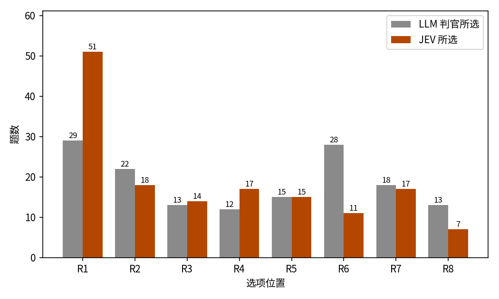
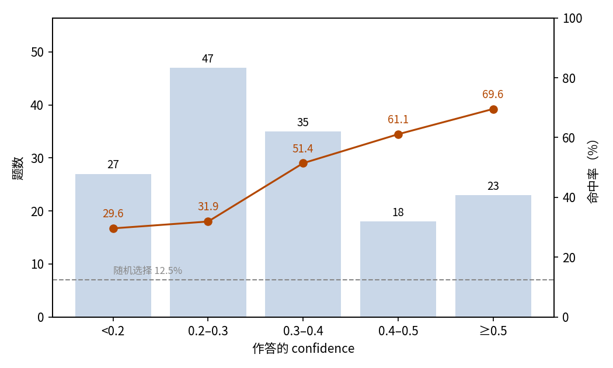

# GRPO Rollout 判优：JEV 八选一并对照 LLM 裁判

## 摘要

本实验测试 JEV 能否像 LLM 裁判那样选出质量最好的思考。场景是 150 道开放式推理题，每题配有同一模型采样的八条思考。DeepSeek LLM 裁判已为每题选出一条赢家，JEV 要在八条中选出同一条。JEV 的命中率为 45.3%（95% 置信区间 37.6%–53.3%）。这一水平远高于 12.5% 的随机水平，但仍有超过一半未命中。它的选择偏向排在前面的思考：34.0% 落在 R1，R8 仅被选 7 次。JEV 报告的 confidence 能排出先后，却始终不够可靠：命中时均值 0.377，未命中时 0.285。把候选文本移入 criteria 后，命中率为 42.0%。标准布局消耗输入 1,020,099 token、输出 12,750 token，总费用 0.0428 美元。八选一中 JEV 的命中率高于随机水平，但位置偏差明显，尚不足以替代裁判直接产出标签。

## 1 实验目的

本实验测量 JEV 判优的能力：在同一道题的八条思考中选出质量最好的一条。场景取自 GRPO 类强化学习的标注环节：同一道题采样出一组 rollout，标注时要从中选出一条赢家，这一步正是八选一。DeepSeek LLM 裁判已按一份书面标准完成选择，本实验考察 JEV 能否复现裁判的选择。

### 与 dpo-jev-judge 的关系

同一批 rollout 与裁判选择也用于成对实验 dpo-jev-judge：那里把裁判选出的赢家与同题随机一条落选思考配成一对，由 JEV 二选一（见 experiments/dpo-jev-judge/report/REPORT.md）。两个实验测同一种判优能力的两种粒度：组内八选一（本实验）与成对二选一。二选一形态的一致率为 83.3%。

## 2 数据集

数据集包含 150 道中文开放式推理题，场景取自日常生活。每题配有八条思考（R1–R8），由 Qwen3-0.6B 开启思考模式、以 temperature 1.0 采样。各条只有推理过程、没有结论，顺序即采样顺序。DeepSeek 裁判按一份书面质量标准（无矛盾、覆盖所问、可跟随、对象具体）为每题选出一条赢家，该赢家即参考答案。JEV 使用同一份书面标准作答。

题目按形式分三类：现象解释、原因排查、权衡建议，各 50 道。本次分析从 id 前缀（g-causal、g-diagnosis、g-tradeoff）还原出这一划分；它不是样本的原始标签。

每道题以两种布局呈现。标准布局把八条思考放在 `state.responses`，criteria 只放指向它们的指针；criteria-text 布局把思考文本直接作为 criteria，state 只留题目。

## 3 最小示例

本节取数据集中的一道题，展示它在两种布局下的输入与输出，便于对照变体差异。两种布局的题目文本相同，差别只在八条思考放在哪里。标准布局下，发给模型的输入如下（省略 model 字段）：

```json
{
  "state": {
    "prompt": "一位同事离职前留下一份交接文档，接手的职员照着文档操作却还是经常出错。请你解释为什么有文档交接仍然会出错。",
    "responses": {
      "R1": "好的，我现在要解决这个问题。用户说，一位同事离职前留了一份交接文档，接手的人照着操作却出了问题。用户想知道为什么还有这样的文档交接会出错，这可能是为什么。首先，我得考虑常见的原因。可能文档本身存在问题，比如不完整的，或者用词不当。……",
      "…": "……R2 至 R8 省略……"
    }
  },
  "questions": {
    "winner_overall": {
      "type": "choice",
      "instructions": "一、任务\n从 responses.R1 至 R8 中选出思维质量最好的一条。\n……（其余六节省略）",
      "criteria": {
        "R1": "responses.R1",
        "R2": "responses.R2",
        "…": "…",
        "R8": "responses.R8"
      }
    }
  }
}
```

模型输出如下（仅保留关键字段）：

```json
{
  "answers": {
    "winner_overall": {
      "type": "choice",
      "choice": "R5",
      "probabilities": {"R1": 0.07, "R2": 0.21, "R3": 0.09, "R4": 0.12, "R5": 0.43, "R6": 0.02, "R7": 0.04, "R8": 0.02},
      "confidence": 0.35
    }
  },
  "usage": {"input_tokens": 4872, "output_tokens": 85, "cost": 0.000204624}
}
```

JEV 选择了 R5，与 LLM 裁判的选择一致。

同一道题在 criteria-text 布局下的输入如下：state 只留题目，八条思考的原文直接作为 criteria。

```json
{
  "state": {
    "prompt": "一位同事离职前留下一份交接文档，接手的职员照着文档操作却还是经常出错。请你解释为什么有文档交接仍然会出错。"
  },
  "questions": {
    "winner_overall": {
      "type": "choice",
      "instructions": "一、任务\n从 responses.R1 至 R8 中选出思维质量最好的一条。\n……（其余六节省略）",
      "criteria": {
        "R1": "好的，我现在要解决这个问题。用户说，一位同事离职前留了一份交接文档，接手的人照着操作却出了问题。……",
        "…": "……R2 至 R8 省略……"
      }
    }
  }
}
```

该布局下的模型输出如下（仅保留关键字段）：

```json
{
  "answers": {
    "winner_overall": {
      "type": "choice",
      "choice": "R5",
      "probabilities": {"R1": 0.07, "R2": 0.22, "R3": 0.09, "R4": 0.18, "R5": 0.25, "R6": 0.10, "R7": 0.04, "R8": 0.05},
      "confidence": 0.14
    }
  },
  "usage": {"input_tokens": 4778, "output_tokens": 85, "cost": 0.000200676}
}
```

两种布局下 JEV 都选择了 R5，但 criteria-text 布局的概率分布更平坦，confidence 降到 0.14。

## 4 结果

### 整体结果

150 题全部取得有效作答，无失败记录。这些题目是开放式的，没有标准答案，判据是与 DeepSeek LLM 裁判的一致性，而不是正确性。以此为判据，JEV 命中 68 题，命中率 45.3%，95% 置信区间 37.6%–53.3%。八选一随机作答的命中率为 12.5%。

### 按题型分组

三类题型的命中率接近，现象解释最高、权衡建议最低：

| 题型 | 题数 | 命中 | 命中率 |
| --- | ---: | ---: | ---: |
| 现象解释 | 50 | 27 | 54.0% |
| 原因排查 | 50 | 21 | 42.0% |
| 权衡建议 | 50 | 20 | 40.0% |

### 按选项位置分组

裁判的赢家分布在全部八个位置上（最常见的是 R1 占 19.3%、R6 占 18.7%），而 JEV 的选择明显偏向排在前面的位置（图 1）：51 次（34.0%）落在 R1，R8 仅被选 7 次（4.7%）。这一偏差使命中率取决于赢家的位置：赢家在 R1 时 JEV 命中 21/29（72.4%），在 R6 时只有 7/28（25.0%）。



图 1：裁判的赢家散布在各位置，JEV 的选择集中在首位。

### 置信关系

JEV 对每题报告一个 confidence。命中率随 confidence 上升，但作答集中在低 confidence 档，最高一档也远未可靠（图 2）：

| Confidence | 题数 | 占比 | 命中率 |
| --- | ---: | ---: | ---: |
| < 0.2 | 27 | 18.0% | 29.6% |
| 0.2–0.3 | 47 | 31.3% | 31.9% |
| 0.3–0.4 | 35 | 23.3% | 51.4% |
| 0.4–0.5 | 18 | 12.0% | 61.1% |
| ≥ 0.5 | 23 | 15.3% | 69.6% |



图 2：命中率随 confidence 上升，但作答集中在低 confidence 档，没有一档达到可靠水平；虚线为 12.5% 随机水平。

confidence 能排出先后，却始终不够可靠：命中时均值 0.377，未命中时 0.285，作答中位数 0.30，最高值 0.81。任何阈值都无法筛出一批可信的判断。

### 行为统计

148 题的作答概率合计为 1，另 2 题为 0.99。2 题（1.3%）的所选项概率严格低于最高项；另有 3 题（2.0%）的所选项与最高项并列，不算不一致。

### 调用成本

标准布局共消耗输入 1,020,099 token、输出 12,750 token，总费用 0.0428 美元。

### 布局消融

两种布局的差异仅在于候选文本的存放位置。把文本移入 criteria 后，命中率小幅下降（两个区间重叠），位置偏差减弱但未消除，confidence 整体下降：

| 布局 | 命中率（95% 置信区间） | R1 被选次数 | confidence 中位数 | 输入 token | 输出 token | 费用 |
| --- | --- | ---: | ---: | ---: | ---: | ---: |
| 标准布局 | 45.3%（37.6%–53.3%） | 51（34.0%） | 0.30 | 1,020,099 | 12,750 | 0.0428 美元 |
| criteria-text | 42.0%（34.4%–50.0%） | 25（16.7%） | 0.18 | 1,005,999 | 12,750 | 0.0423 美元 |

## 5 结论

在八选一中，JEV 命中 LLM 裁判的比例远高于随机水平（45.3% 对 12.5%），但选择偏向排在前面的候选，且这一偏好随布局变化；confidence 偏低、区分度低，无法作为取舍的阈值。正式标注应交给更强的裁判，或者像 dpo-jev-judge 那样把选择缩减到两条。

## 相关资料

- Qwen3-0.6B（rollout 模型）：https://huggingface.co/Qwen/Qwen3-0.6B
- DeepSeek API 文档（LLM 裁判）：https://api-docs.deepseek.com/
- GRPO 论文（DeepSeekMath）：https://arxiv.org/abs/2402.03300
