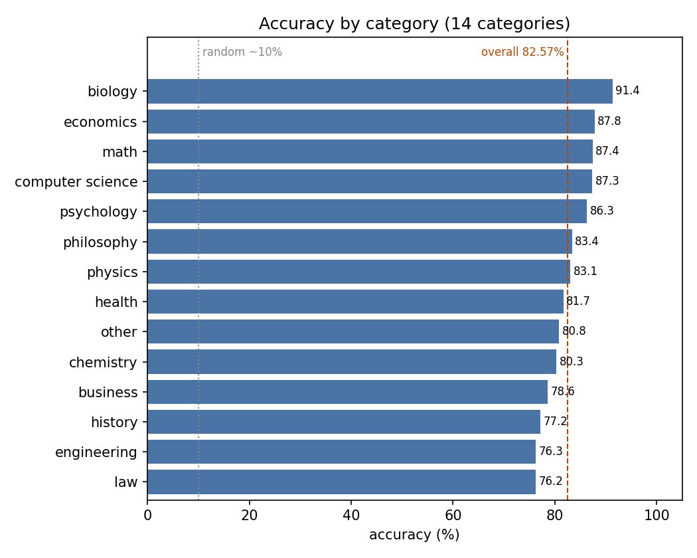
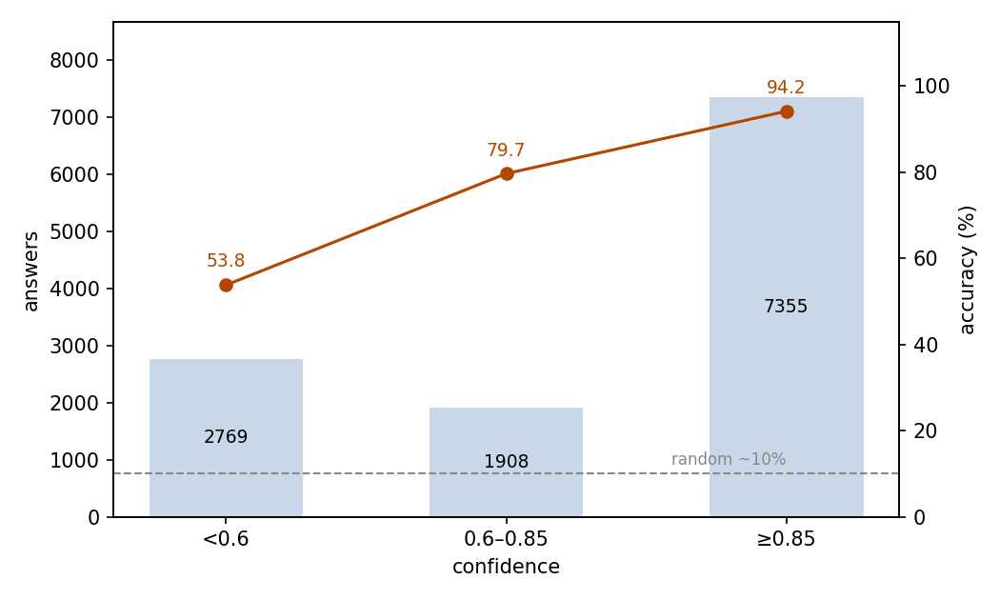
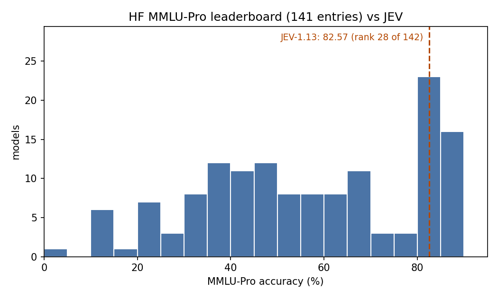

# MMLU-Pro Multi-Discipline Questions: JEV as a Ten-Choice Solver

## Abstract

This experiment asks whether JEV can answer college-level questions from many disciplines. The setting is the full MMLU-Pro test split: 12,032 questions in 14 categories, each answered as a single choice, mostly among ten options. JEV answered 82.57% correctly (95% CI 81.89–83.25%), well above the roughly 10% random-guessing level. Accuracy moves with the category, from 91.35% in biology down to 76.20% in law. The confidence JEV puts on each answer follows accuracy: the 61.1% of answers at confidence ≥0.85 are 94.15% correct, while the low-confidence tier holds 61.0% of all errors. The run used 6,650,732 input tokens and 1,002,474 output tokens, at a total cost of $0.2793. We conclude that JEV answers multi-discipline knowledge questions reliably, and that its confidence separates trustworthy answers from ones that need review.

## 1 Purpose

This experiment asks one question: when a question can come from any discipline, how broad and how reliable is JEV's knowledge? MMLU-Pro is the standard benchmark for this. It covers 14 college-level disciplines, and its ten-option format makes random guessing rarely succeed, which is why we chose it. JEV also puts a confidence value on each answer, and we test whether that value tells us when to trust an answer.

## 2 Dataset

MMLU-Pro is an English multi-discipline benchmark, built as a harder version of MMLU. We use the full test split of TIGER-Lab/MMLU-Pro on Hugging Face, at a pinned revision: 12,032 questions.

Each question is a single-choice item: a question stem plus a list of options. Ten options is the usual form (9,981 questions, 83.0%); the remaining 2,051 questions offer three to nine. With ten options, random guessing scores about 10%, the floor for this format.

Every question carries the dataset's own category label. There are 14 categories, sized from math (1,351 questions) down to history (381).

## 3 A Minimal Example

This section shows one real question from the dataset with its complete input and output. The input sent to the model (the model field is omitted):

```json
{
  "state": "Evaluate $\\log_3 81$.",
  "questions": {
    "answer": {
      "type": "choice",
      "instructions": "Pick the correct option.",
      "criteria": {
        "A": "9",
        "B": "-1",
        "C": "0.25",
        "D": "2",
        "E": "4",
        "F": "-4",
        "G": "81",
        "H": "3",
        "I": "27",
        "J": "0.75"
      }
    }
  }
}
```

The model's output (key fields only):

```json
{
  "answers": {
    "answer": {
      "type": "choice",
      "choice": "E",
      "probabilities": {"A": 0, "B": 0, "C": 0, "D": 0, "E": 0.99, "F": 0, "G": 0, "H": 0.01, "I": 0, "J": 0},
      "confidence": 0.99
    }
  },
  "usage": {"input_tokens": 420, "output_tokens": 87, "cost": 0.00001764}
}
```

JEV chose E (that is, 4), the correct answer.

## 4 Results

### Overall

All 12,032 questions got a valid answer; no call failed. Judged against the reference answers provided by the dataset, 9,935 answers are correct: an accuracy of 82.57%, with a 95% confidence interval of 81.89–83.25%. Random guessing over ten options scores about 10%.

### By category

Accuracy varies by category, but stays inside a narrow band (Figure 1):

| Category | Questions | Accuracy |
| --- | ---: | ---: |
| biology | 717 | 91.35% |
| economics | 844 | 87.80% |
| math | 1,351 | 87.42% |
| computer science | 410 | 87.32% |
| psychology | 798 | 86.34% |
| philosophy | 499 | 83.37% |
| physics | 1,299 | 83.06% |
| health | 818 | 81.66% |
| other | 924 | 80.84% |
| chemistry | 1,132 | 80.30% |
| business | 789 | 78.58% |
| history | 381 | 77.17% |
| engineering | 969 | 76.26% |
| law | 1,101 | 76.20% |



Figure 1: all 14 categories land between 76% and 91%; biology, economics, and math lead, while law, engineering, and history form the bottom; all lie far above the random level.

### Confidence and accuracy

JEV puts a confidence value on each answer. Accuracy climbs with every rise in confidence (Figure 2):

| Confidence | Answers | Share | Accuracy |
| --- | ---: | ---: | ---: |
| < 0.6 | 2,769 | 23.0% | 53.81% |
| 0.6–0.85 | 1,908 | 15.9% | 79.66% |
| ≥ 0.85 | 7,355 | 61.1% | 94.15% |



Figure 2: most answers lie in the top confidence tier, and accuracy climbs as confidence rises; the dashed line marks the roughly 10% level of random guessing.

### Behavior

Errors concentrate in low-confidence answers: the <0.6 tier holds only 23.0% of the answers but 61.0% of the 2,097 errors. Two kinds of irregularity occur at low rates: in 294 answers (2.44%) the option probabilities add up to 0.99 instead of 1, and in 16 answers (0.13%) the chosen option's probability is lower than that of the top option. In 53 more answers, several options tie for the top probability and the answer picks one of them, and in four the top option differs only in the last floating-point digit. Neither of those last two counts as an inconsistency.

### Cost

The run consumed 6,650,732 input tokens and 1,002,474 output tokens, for a total cost of $0.2793.

### Benchmark positioning

A public leaderboard shows where JEV stands. The Hugging Face MMLU-Pro leaderboard snapshot lists 141 entries, with scores from 0.65 to 88.12 and a median of 55.99. JEV's 82.57 is near the top: 27 entries score higher, which puts JEV 28th of 142 (Figure 3). Most entries on the board answer by generating free text, often with long reasoning, while JEV answers by picking a choice. The formats differ, so treat this as a rough scale reference only.



Figure 3: among the 141 leaderboard entries plus JEV, JEV ranks 28th, well above the median.

## 5 Conclusion

JEV answers about four in five MMLU-Pro questions correctly, against a floor of roughly 10% from random guessing, and no category comes close to that floor. Two findings extend beyond the score. Confidence follows accuracy closely enough to act on: accepting the ≥0.85 tier keeps 94.15% accuracy over most questions, while the <0.6 tier concentrates most errors in a small share of answers. The gap between disciplines, from 91.35% in biology down to 76.20% in law, marks where extra checks are warranted.

## Related Resources

- MMLU-Pro dataset: https://huggingface.co/datasets/TIGER-Lab/MMLU-Pro
- MMLU-Pro paper: https://arxiv.org/abs/2406.01574
- Hugging Face MMLU-Pro leaderboard snapshot: https://huggingface.co/api/datasets/TIGER-Lab/MMLU-Pro/leaderboard
