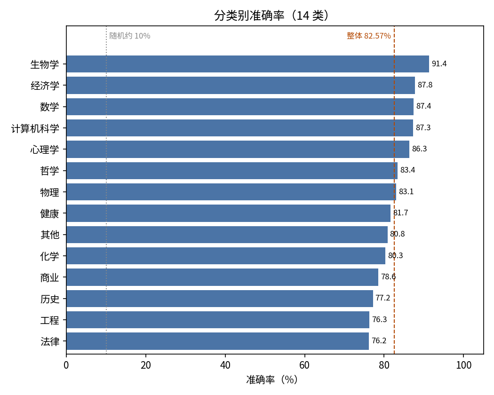
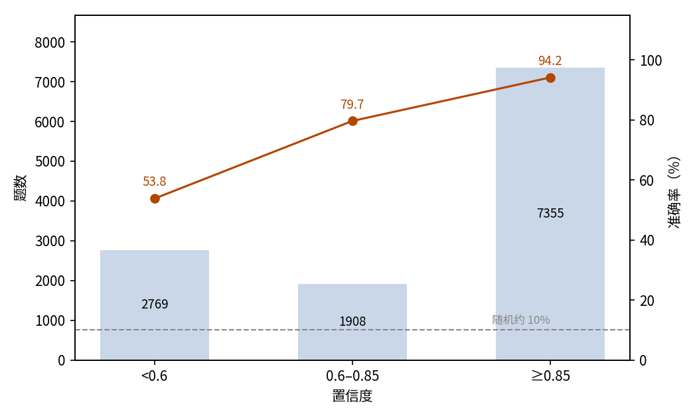
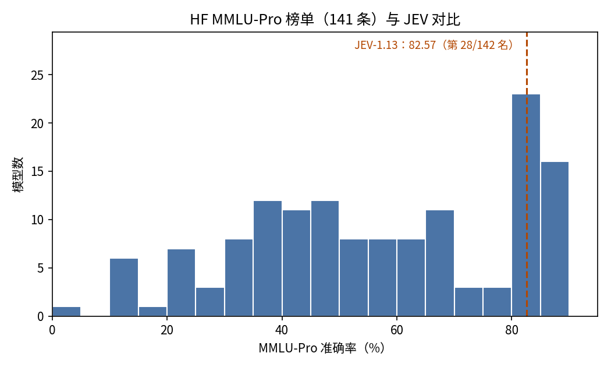

# MMLU-Pro 多学科知识问答：JEV 十选一作答评估

## 摘要

本实验测试 JEV 解答各学科大学水平题目的能力。场景是 MMLU-Pro 测试集的全部 12,032 题，覆盖 14 个类别，每题以单选作答，选项以十个为主。JEV 答对 82.57%（95% 置信区间 81.89%–83.25%），远高于约 10% 的随机水平。准确率按类别分化：生物学最高 91.35%，法律最低 76.20%。JEV 给每题标的 confidence 与准确率一致：confidence 不低于 0.85 的作答占 61.1%，准确率 94.15%；全部错误的 61.0% 集中在低置信档。全部作答消耗输入 6,650,732 token、输出 1,002,474 token，总费用 0.2793 美元。结论是 JEV 能稳定解答多学科知识题，其 confidence 输出可直接用于区分可信作答与需要复核的作答。

## 1 实验目的

本实验回答一个问题：题目可能来自任意学科时，JEV 的知识面有多宽、作答有多可靠。MMLU-Pro 是这一能力的标准基准：覆盖 14 个大学水平学科，十选项形式让随机猜测难以得分，因此被选作测试场景。JEV 同时会给每题标一个 confidence 值，本实验一并检验这个值能否用来判断一条作答可不可信。

## 2 数据集

MMLU-Pro 是英文多学科基准，作为 MMLU 的加强版构建。本实验使用 Hugging Face 上 TIGER-Lab/MMLU-Pro 固定修订版本的全部测试集：12,032 道题。

每道题以一道单选题的形式呈现：一个题干加一组选项。十个选项是主要形式（9,981 题，占 83.0%），其余 2,051 题的选项为三到九个。十个选项下随机作答的期望准确率约 10%，这是该形式的下限参照。

每道题带数据集自带的类别标签：共 14 类，题量从数学的 1,351 题到历史的 381 题不等。

## 3 最小示例

本节取数据集中的一题，展示一次完整的输入与输出。发给模型的输入如下（省略 model 字段）：

```json
{
  "state": "计算 $\\log_3 81$ 的值。",
  "questions": {
    "answer": {
      "type": "choice",
      "instructions": "选出正确选项。",
      "criteria": {
        "A": "9",
        "B": "-1",
        "C": "0.25",
        "D": "2",
        "E": "4",
        "F": "-4",
        "G": "81",
        "H": "3",
        "I": "27",
        "J": "0.75"
      }
    }
  }
}
```

模型输出如下（仅保留关键字段）：

```json
{
  "answers": {
    "answer": {
      "type": "choice",
      "choice": "E",
      "probabilities": {"A": 0, "B": 0, "C": 0, "D": 0, "E": 0.99, "F": 0, "G": 0, "H": 0.01, "I": 0, "J": 0},
      "confidence": 0.99
    }
  },
  "usage": {"input_tokens": 420, "output_tokens": 87, "cost": 0.00001764}
}
```

JEV 选择了 E（即 4），即正确答案。

## 4 结果

### 整体结果

12,032 题全部获得有效作答，无失败记录。以数据集提供的标准答案为判据，JEV 答对 9,935 题，准确率 82.57%，95% 置信区间 81.89%–83.25%。十个选项下随机作答的期望准确率约 10%。

### 分组结果

准确率按类别分化，但落在较窄的区间内（图 1）：

| 类别 | 题数 | 准确率 |
| --- | ---: | ---: |
| biology（生物学） | 717 | 91.35% |
| economics（经济学） | 844 | 87.80% |
| math（数学） | 1,351 | 87.42% |
| computer science（计算机科学） | 410 | 87.32% |
| psychology（心理学） | 798 | 86.34% |
| philosophy（哲学） | 499 | 83.37% |
| physics（物理） | 1,299 | 83.06% |
| health（健康） | 818 | 81.66% |
| other（其他） | 924 | 80.84% |
| chemistry（化学） | 1,132 | 80.30% |
| business（商业） | 789 | 78.58% |
| history（历史） | 381 | 77.17% |
| engineering（工程） | 969 | 76.26% |
| law（法律） | 1,101 | 76.20% |



图 1：14 个类别的准确率都落在 76% 到 91% 之间，生物学、经济学、数学领先，法律、工程、历史垫底，全部远高于随机水平。

### 置信关系

JEV 对每题给出一个 confidence 值。准确率随 confidence 单调上升（图 2）：

| Confidence | 题数 | 占比 | 准确率 |
| --- | ---: | ---: | ---: |
| < 0.6 | 2,769 | 23.0% | 53.81% |
| 0.6–0.85 | 1,908 | 15.9% | 79.66% |
| ≥ 0.85 | 7,355 | 61.1% | 94.15% |



图 2：作答集中在最高置信档，准确率随 confidence 单调上升；虚线为约 10% 的随机水平。

### 行为统计

错误集中在低置信作答：<0.6 档只占作答的 23.0%，却占了 2,097 道错题的 61.0%。输出存在两类少量瑕疵：294 条作答（2.44%）的选项概率合计不等于 1；45 条作答（0.37%）所选的选项不是概率最高的选项。

### 调用成本

本次实验共消耗输入 6,650,732 token、输出 1,002,474 token，总费用 0.2793 美元。

### 能力定位

与公开榜单对比可以标定 JEV 的相对位置。Hugging Face MMLU-Pro 榜单快照收录 141 条结果，分数区间 0.65–88.12，中位数 55.99。JEV 的 82.57 接近顶部：高于它的有 27 条，JEV 在 142 个结果中排第 28（图 3）。榜单上的模型多以自由生成形式作答、常带长推理过程，JEV 以直接选择作答；两者作答形式不同，这一对比只作量级参照。



图 3：在 141 条上榜结果加 JEV 共 142 个结果中，JEV 排第 28，处于领先集团之内，远高于中位数。

## 5 结论

在约 10% 的随机下限之上，JEV 答对了约八成三的 MMLU-Pro 题目，且没有任何类别接近猜测水平。比分数更有价值的两点：confidence 与准确率的对应足够稳定，可以直接行动——接受不低于 0.85 的作答即可以 94.15% 的准确率保留大部分题目，而低置信档以很小的作答份额装下了大部分错误；学科差距（生物学 91.35% 对法律 76.20%）则标出了额外核验最值得投入的地方。

## 6 洞察

1. JEV 在靠计算与成熟事实作答的学科（生物学、经济学、数学）上更强，在法律、工程、历史上偏弱；在偏弱学科使用 JEV 时应默认加复核。
2. confidence 开箱即可用作分流开关：高置信作答直接采用；低置信作答占比小，却装下了大部分错误，转交复核即可。
3. 十选项让蒙对变得罕见，MMLU-Pro 上的选择题分数反映的是知识而非运气。
4. JEV 的输出并不总是自洽：下游应以显式的 choice 字段为答案，并对概率做归一化，而不是假设两者必然一致。

## 相关资料

- MMLU-Pro 数据集：https://huggingface.co/datasets/TIGER-Lab/MMLU-Pro
- MMLU-Pro 论文：https://arxiv.org/abs/2406.01574
- Hugging Face MMLU-Pro 榜单快照：https://huggingface.co/api/datasets/TIGER-Lab/MMLU-Pro/leaderboard
