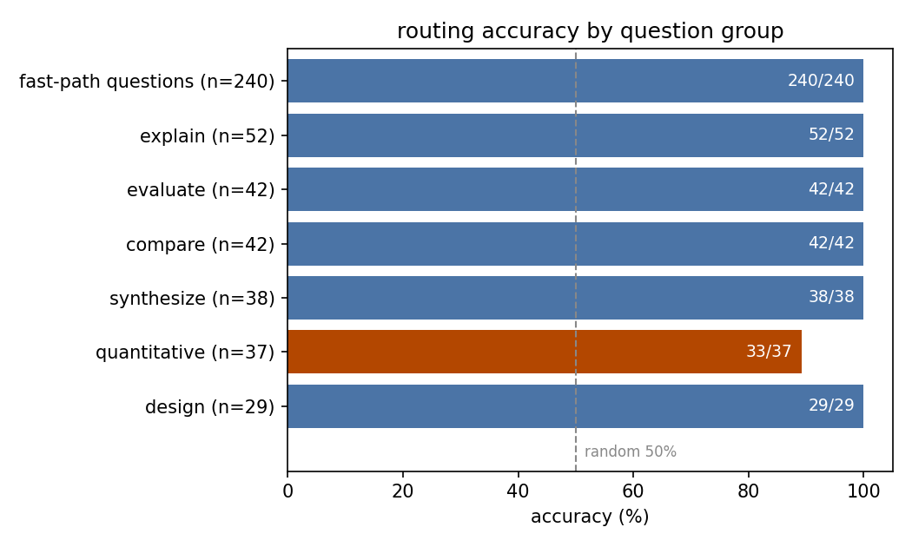
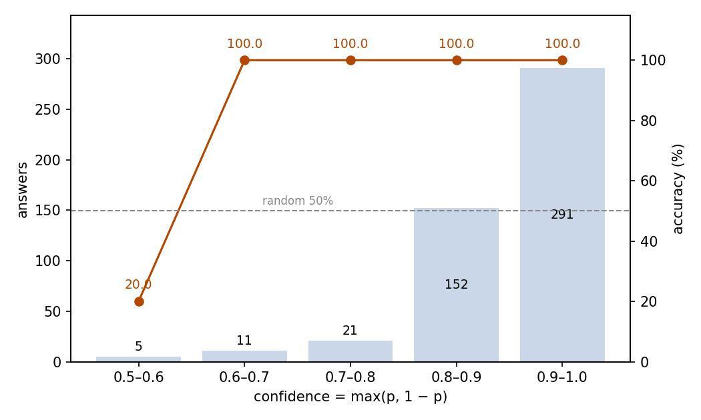

# Prompt Routing for a Paper-QA System: JEV as the Entry Router

## Abstract

This experiment tests whether JEV can route a reader's question to the right answerer before any retrieval happens. The setting is a paper-QA system with two paths: a fast path where JEV answers from fetched material, and a slow path where an LLM reads the paper and writes a full answer. The router sees only the question text. The dataset holds 480 questions over 24 research papers: 240 that belong on the fast path and 240 on the slow path. The slow-path questions fall into six categories, each demanding a written answer. JEV routed 476 of 480 correctly (99.2%, 95% CI 97.9–99.7%) against a random baseline of 50%. Fast-path questions were never misrouted. The only category with lower accuracy is quantitative questions (89.2%), and every miss carries a low-confidence mark. The run consumed 452,494 input tokens and 10,560 output tokens, costing $0.0190. JEV is reliable enough to serve as the entry router directly, and its confidence output identifies the misses in that category.

## 1 Purpose

A paper-QA system with two answerers must decide, the moment a question arrives, which answerer should handle it: the decision model, which is fast and cheap but returns only conclusions, or an LLM, which is slower and costlier but can explain, assess, and compute. This experiment tests whether JEV can make that decision on its own, early, from the question text alone, before the system fetches any paper content. A wrong decision either wastes an expensive full-paper read or, worse, sends the fast path a question it cannot answer well.

## 2 Dataset

The questions are built over a library of 24 arXiv research papers on LLM agents, the same library paper-qa uses (links in Related Resources). Each paper contributes 20 questions, 10 fast-path and 10 slow-path, 480 in total.

The 240 fast-path questions are the paper-qa experiment's question set, with the same ids and question text: yes/no questions that JEV answers from a fetched paper excerpt. The 240 slow-path questions were written for this experiment. Each falls into one of six categories and demands an answer the decision model cannot give. Explain questions (52) ask why or how something works; evaluate questions (42) ask how effective or how reliable something is; compare questions (42) ask how one thing differs from another; synthesize questions (38) ask for several parts of the paper to be combined into one account; quantitative questions (37) ask for a new value worked out from numbers the paper reports; design questions (29) ask how the system would have to change. Every slow-path question carries its category label in the sample metadata.

Routing happens before retrieval, so a sample's state contains only the question text — no paper content. The two classes are balanced, making 50% the random baseline.

## 3 A Minimal Example

This section shows one real question with its complete input and output. The input sent to the model (the model field is omitted; the instructions are truncated, with ellipses marking the omissions):

```json
{
  "state": {
    "prompt": "Are the entity summaries stored in HINDSIGHT's observation network supposed to be preference-neutral?"
  },
  "questions": {
    "use_fast_path": {
      "type": "noul",
      "instructions": "[Decision model capabilities] The decision model (Jev) is a System One model: given material (the state), it makes fast judgments and returns typed conclusions with probabilities instead of text. … [Routing standard] To the decision model: the question asks for a judgment — a yes/no answer, a choice among the given options, or a rating on a scale. To the LLM: the question asks for text — an explanation, a summary, an evaluation, a design, or an analysis; or a new value worked out from numbers the paper reports. … [Question] Should this question be routed to the decision model? (true = the decision model; false = the LLM)",
      "criteria": {
        "true": "The question asks for a judgment — a yes/no answer, a choice among the given options, or a rating.",
        "false": "The question asks for text — an explanation, a summary, an evaluation, a design, or an analysis; or a new value worked out from numbers the paper reports (the decision model does no exact computation)."
      }
    }
  }
}
```

The model's output (key fields only):

```json
{
  "answers": {"use_fast_path": {"type": "noul", "noul": 0.94}},
  "usage": {"input_tokens": 939, "output_tokens": 22, "cost": 0.0000394}
}
```

JEV returned 0.94 for routing to the fast path, matching the reference: this yes/no question belongs on the fast path.

## 4 Results

### Overall

All 480 questions received a valid answer; no call failed. Judged against the reference label each sample carries, 476 routings are correct: an accuracy of 99.2%, with a 95% confidence interval of 97.9–99.7%. Random routing over the balanced classes yields 50%.

### By group

No fast-path question is routed to the slow path; among the slow-path categories, only quantitative questions fall below 100% (Figure 1):

| Group | Questions | Correct | Accuracy |
| --- | ---: | ---: | ---: |
| fast-path questions | 240 | 240 | 100% |
| slow-path questions | 240 | 236 | 98.3% |
| — explain | 52 | 52 | 100% |
| — evaluate | 42 | 42 | 100% |
| — compare | 42 | 42 | 100% |
| — synthesize | 38 | 38 | 100% |
| — quantitative | 37 | 33 | 89.2% |
| — design | 29 | 29 | 100% |



Figure 1: quantitative questions are the only group below 100%; the dashed line marks the 50% random level.

All four misses are quantitative questions sent to the fast path, with output values between 0.50 and 0.57: one falls exactly at the midpoint, and the rest lean only slightly toward yes.

### Confidence and accuracy

The noul output value p is the probability of "route to the fast path"; confidence here means max(p, 1 − p), the probability of the side the model favors. Errors occur only in the lowest band; every other band is entirely correct (Figure 2):

| Confidence | Answers | Share | Accuracy |
| --- | ---: | ---: | ---: |
| 0.9–1.0 | 291 | 60.6% | 100% |
| 0.8–0.9 | 152 | 31.7% | 100% |
| 0.7–0.8 | 21 | 4.4% | 100% |
| 0.6–0.7 | 11 | 2.3% | 100% |
| 0.5–0.6 | 5 | 1.0% | 20.0% |



Figure 2: 92.3% of answers sit above 0.8 confidence and are all correct; every error lives in the lowest band. The dashed line marks the 50% random level.

### Behavior

Routing outputs are almost binary: correct fast-path routings all have p of at least 0.60, and correct slow-path routings all have p of at most 0.39. Only five answers (1.0%) fall in the 0.4–0.6 band, and four of them are the quantitative misses.

### Cost

The run consumed 452,494 input tokens and 10,560 output tokens, for a total cost of $0.0190.

### System position

This experiment is one of three that measure a paper-QA system built around JEV. [paper-classification](../../paper-classification/report/REPORT.md) manages the paper library: given the reader's research preference, it decides which arXiv papers enter the library and tags each with a topic. prompt-routing (this experiment) is the entry router: when the reader asks a question, it decides from the question text alone whether the fast path can take it. [paper-qa](../../paper-qa/report/REPORT.md) is the fast path itself: retrieval fetches the relevant excerpt and JEV answers from it. Questions routed to the slow path are answered by an LLM, which is not part of these experiments. This experiment and paper-qa share the same 24-paper library, and this experiment's 240 fast-path questions are paper-qa's 240 questions with the same ids; the paper-classification corpus was crawled independently.

## 5 Conclusion

From the question text alone, JEV routes the questions in this experiment almost without error: 99.2% on the balanced set, and all 240 fast-path questions land on the fast path. The single category with lower accuracy is quantitative questions, which ask for a new value worked out from the numbers a paper reports. Those misses all fall in the lowest confidence band, so sending that band to the slow path covers every miss in this experiment. JEV can serve as the entry router directly, with its confidence output to flag the routings worth rechecking.

## Related Resources

- Hindsight is 20/20: Building Agent Memory that Retains, Recalls, and Reflects: https://arxiv.org/abs/2512.12818
- EverMemOS: A Self-Organizing Memory Operating System for Structured Long-Horizon Reasoning: https://arxiv.org/abs/2601.02163
- Terminal-Bench: Benchmarking Agents on Hard, Realistic Tasks in Command Line Interfaces: https://arxiv.org/abs/2601.11868
- The Landscape of Prompt Injection Threats in LLM Agents: From Taxonomy to Analysis: https://arxiv.org/abs/2602.10453
- Gaia2: Benchmarking LLM Agents on Dynamic and Asynchronous Environments: https://arxiv.org/abs/2602.11964
- On Data Engineering for Scaling LLM Terminal Capabilities: https://arxiv.org/abs/2602.21193
- Reasoning Models Struggle to Control their Chains of Thought: https://arxiv.org/abs/2603.05706
- Meta-Harness: End-to-End Optimization of Model Harnesses: https://arxiv.org/abs/2603.28052
- ByteRover: Agent-Native Memory Through LLM-Curated Hierarchical Context: https://arxiv.org/abs/2604.01599
- Emotion Concepts and their Function in a Large Language Model: https://arxiv.org/abs/2604.07729
- Thinking Without Words: Efficient Latent Reasoning with Abstract Chain-of-Thought: https://arxiv.org/abs/2604.22709
- ALSO: Adversarial Online Strategy Optimization for Social Agents: https://arxiv.org/abs/2605.15768
- How Well Do Models Follow Their Constitutions?: https://arxiv.org/abs/2605.24229
- Harness Updating Is Not Harness Benefit: Disentangling Evolution Capabilities in Self-Evolving LLM Agents: https://arxiv.org/abs/2605.30621
- MCP-Persona: Benchmarking LLM Agents on Real-World Personal Applications via Environment Simulation: https://arxiv.org/abs/2606.02470
- Emergence World: A Platform for Evaluating Long-Horizon Multi-Agent Autonomy: https://arxiv.org/abs/2606.08367
- The Periodic Table of LLM Reasoning: A Structured Survey of Reasoning Paradigms, Methods, and Failure Modes: https://arxiv.org/abs/2606.11470
- ExpRL: Exploratory RL for LLM Mid-Training: https://arxiv.org/abs/2606.17024
- Adaptive Evaluation of Out-of-Band Defenses Against Prompt Injection in LLM Agents: https://arxiv.org/abs/2606.26479
- Piggybacking on Perception: Stealthy Concurrent Audio Prompt Injections against Multimodal LLM Agents: https://arxiv.org/abs/2607.28165
- Code Is the Body: Agent-Owned Software Bodies for Recursive Evolution and Descent: https://arxiv.org/abs/2607.28691
- Test-Time Scaling in Reasoning LLMs: Inference Regimes, Evaluation, and Reproducibility: https://arxiv.org/abs/2608.04001
- Demystifying Reinforcement Learning Post-Training of Language Models: https://arxiv.org/abs/2608.24949
- The Last AI Built by Humans: Toward Genuine Recursive Self-Improvement: https://arxiv.org/abs/2609.11873
