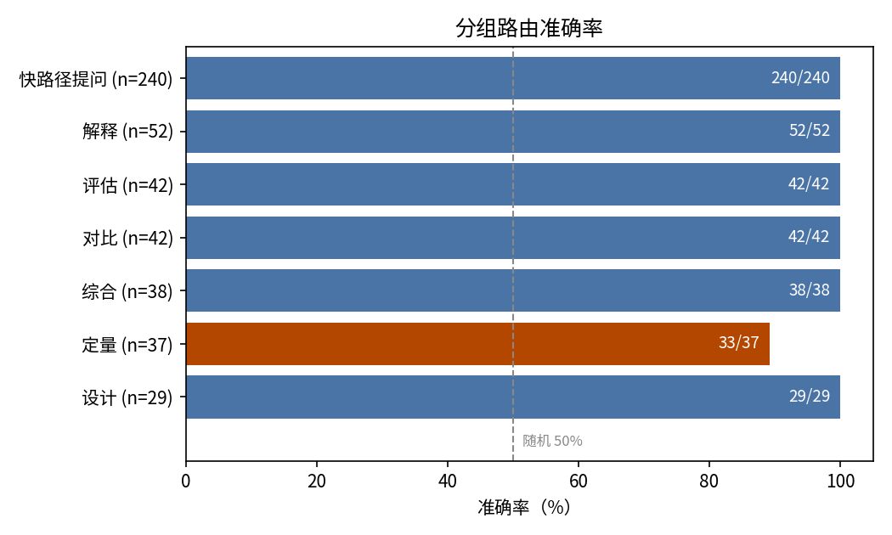
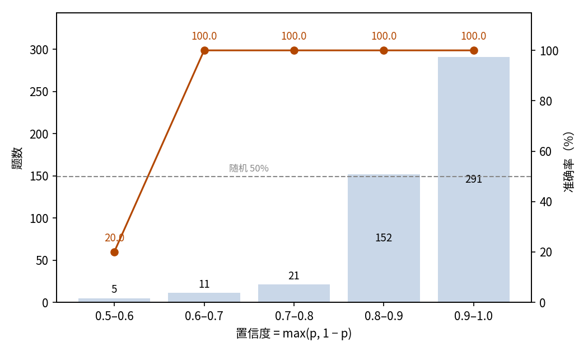

# 论文问答系统的入口路由：JEV 判断提问走快路径还是慢路径

## 摘要

本实验测试 JEV 在论文问答系统中承担入口路由的能力：读者提问到达时、检索发生之前，仅凭提问文本判断该把提问交给 JEV 快路径还是 LLM 慢路径。数据集包含 24 篇论文上的 480 个提问：240 个该走快路径，240 个该走慢路径，后者覆盖六类需要文字作答的提问。JEV 路由正确 476/480（99.2%，95% 置信区间 97.9%–99.7%），远高于 50% 的随机水平：快路径提问全部判对，唯一的弱区是定量计算类提问（89.2%），且全部误判都带低置信标记。本次运行消耗输入 452,494 token、输出 10,560 token，总费用 0.0190 美元。结论是 JEV 可直接承担入口路由，其置信输出足以为唯一弱区兜底。

## 1 实验目的

论文问答系统有两条作答路径：快路径先检索取回材料，再由决策模型直接给出结论，快且便宜；慢路径由 LLM 自己通读论文、逐步推理并写出文字回答，慢且贵，但能解释、评估和计算。提问到达的一刻，系统就要决定把它交给谁。本实验测试 JEV 能否独自做出这个路由判断——而且要做得早：在检索之前、仅凭提问文本。判错的代价并不对称：误给慢路径只是浪费一次全文阅读，误给快路径则会让一个它答不好的提问只拿到一句结论。

## 2 数据集

提问围绕 24 篇 arXiv 上的 LLM 智能体研究论文构造，论文库与另两个组件实验共用（链接见相关资料）。每篇论文 20 题——10 个快路径提问、10 个慢路径提问——共 480 题。

240 个快路径提问即 paper-qa 实验的全部题目，id 与提问文本相同，都是 JEV 依据取回的论文节选作答的是非题。240 个慢路径提问为本实验专门编写，每题都要求一种决策模型给不出的回答，分六类：解释（52 题，问机理或原因）、评估（42 题，问多好、多可靠）、对比（42 题，问与他者的差异）、综合（38 题，要求把论文多处内容汇总成一段说明）、定量（37 题，要求用论文报告的数字算出新值）、设计（29 题，问系统要如何修改）。每个慢路径提问的样本 metadata 都带有 category 类别标签。

路由发生在检索之前，样本的 state 只含提问文本，不含论文内容。两类各占一半，随机参照为 50%。

## 3 最小示例

本节取数据集中真实的一题，展示一次完整的输入与输出。发给模型的输入如下（省略 model 字段；instructions 过长，截断处以省略号标出）：

```json
{
  "state": {
    "prompt": "HINDSIGHT 的观察网络中存储的实体摘要应当是偏好中立的吗？"
  },
  "questions": {
    "use_fast_path": {
      "type": "noul",
      "instructions": "[决策模型能力] 决策模型（Jev）是一个系统一模型：给定材料（state），它做出快速判断，返回带概率的类型化结论而非文本。…… [路由标准] 交给决策模型：提问要求一个判断——一个是非答案、给定选项中的一个选择、或量表上的一个评级。交给 LLM：提问要求文本——解释、总结、评估、设计或分析；或根据论文报告的数字算出的新值。…… [问题] 这个提问应该路由给决策模型吗？（true = 决策模型；false = LLM）",
      "criteria": {
        "true": "提问要求一个判断——是非答案、给定选项中的选择或评级。",
        "false": "提问要求文本——解释、总结、评估、设计或分析；或根据论文报告的数字算出的新值（决策模型不做精确计算）。"
      }
    }
  }
}
```

模型输出如下（仅保留关键字段，输出 JSON 不翻译）：

```json
{
  "answers": {"use_fast_path": {"type": "noul", "noul": 0.94}},
  "usage": {"input_tokens": 939, "output_tokens": 22, "cost": 0.0000394}
}
```

JEV 对「走快路径」给出 0.94，与参考标签一致：这道是非题属于快路径。

## 4 结果

### 整体结果

480 题全部获得有效作答，无失败记录。以样本自带的参考标签为判据，476 题路由正确，准确率 99.2%，95% 置信区间 97.9%–99.7%。两类均衡，随机路由的期望准确率为 50%。

### 分组结果

快路径提问从未被误拦；慢路径提问中只有定量类低于 100%（图 1）：

| 组 | 题数 | 正确 | 准确率 |
| --- | ---: | ---: | ---: |
| 快路径提问 | 240 | 240 | 100% |
| 慢路径提问 | 240 | 236 | 98.3% |
| — 解释 | 52 | 52 | 100% |
| — 评估 | 42 | 42 | 100% |
| — 对比 | 42 | 42 | 100% |
| — 综合 | 38 | 38 | 100% |
| — 定量 | 37 | 33 | 89.2% |
| — 设计 | 29 | 29 | 100% |



图 1：定量类是唯一低于 100% 的组；虚线为 50% 随机水平。

4 个错例全是被误判进快路径的定量类提问，输出值在 0.50–0.57 之间——模型只是勉强倾向「是」。

### 置信关系

noul 输出值 p 是「走快路径」的概率；下文取置信度 max(p, 1 − p)，即模型倾向一侧的概率。0.6 以上各档全部正确，错误只落在最低档（图 2）：

| 置信度 | 题数 | 占比 | 准确率 |
| --- | ---: | ---: | ---: |
| 0.9–1.0 | 291 | 60.6% | 100% |
| 0.8–0.9 | 152 | 31.7% | 100% |
| 0.7–0.8 | 21 | 4.4% | 100% |
| 0.6–0.7 | 11 | 2.3% | 100% |
| 0.5–0.6 | 5 | 1.0% | 20.0% |



图 2：92.3% 的作答在 0.8 置信度以上且全部正确，错误只落在最低档；虚线为 50% 随机水平。

### 行为统计

路由输出接近二分：判对的快路径提问 p 全部不低于 0.60，判对的慢路径提问 p 全部不高于 0.39。落在 0.4–0.6 区间的作答只有 5 题（1.0%），其中 4 题正是定量类的误判——输出不确定与路由错误完全重合。

### 调用成本

本次实验共消耗输入 452,494 token、输出 10,560 token，总费用 0.0190 美元。

### 系统位置

本实验是围绕 JEV 搭建的论文问答系统三联组件之一。[paper-classification](../../paper-classification/report/REPORT.md) 管理论文库：依据读者的研究偏好决定哪些 arXiv 论文入库，并标注各自主题。prompt-routing（本实验）是入口路由：读者提问到达时，仅凭提问文本判断快路径能否作答。[paper-qa](../../paper-qa/report/REPORT.md) 是快路径本身：检索取回相关节选，JEV 依据节选作答。被路由到慢路径的提问由 LLM 回答，不在这些实验范围内。三个组件共用同一个 24 篇论文的论文库，本实验的 240 个快路径提问即 paper-qa 的 240 题，id 相同。

## 5 结论

仅凭提问文本，JEV 的路由几乎无懈可击：均衡数据上准确率 99.2%，快路径提问从未被误拦。唯一的弱区是要求从论文数字算出新值的定量类提问，而这些误判全部带有低置信标记——把低置信的路由决策兜底给慢路径，恰好拦下全部会漏进快路径的提问。JEV 可直接担任入口路由，置信输出就是现成的护栏。

## 6 洞察

1. 路由不需要论文内容：仅凭提问文本即可判断，路由可以放在检索之前，把慢路径的全文阅读留给真正需要的提问。
2. 要求从论文数字算出新值的定量类提问是路由的弱区；系统中应对这类提问加专门护栏（关键词检查或二次确认），而不是直接信任路由结果。
3. 弱区会自报家门：误判的提问全部带着低置信标记，把低置信的路由决策交给慢路径即可拦下全部错误，且不影响其余提问。
4. 路由错误只有一个方向：慢路径提问可能漏进快路径，快路径提问从不被反向误拦，护栏只需复查「判给快路径」的决策。

## 相关资料

- Hindsight is 20/20: Building Agent Memory that Retains, Recalls, and Reflects：https://arxiv.org/abs/2512.12818
- EverMemOS: A Self-Organizing Memory Operating System for Structured Long-Horizon Reasoning：https://arxiv.org/abs/2601.02163
- Terminal-Bench: Benchmarking Agents on Hard, Realistic Tasks in Command Line Interfaces：https://arxiv.org/abs/2601.11868
- The Landscape of Prompt Injection Threats in LLM Agents: From Taxonomy to Analysis：https://arxiv.org/abs/2602.10453
- Gaia2: Benchmarking LLM Agents on Dynamic and Asynchronous Environments：https://arxiv.org/abs/2602.11964
- On Data Engineering for Scaling LLM Terminal Capabilities：https://arxiv.org/abs/2602.21193
- Reasoning Models Struggle to Control their Chains of Thought：https://arxiv.org/abs/2603.05706
- Meta-Harness: End-to-End Optimization of Model Harnesses：https://arxiv.org/abs/2603.28052
- ByteRover: Agent-Native Memory Through LLM-Curated Hierarchical Context：https://arxiv.org/abs/2604.01599
- Emotion Concepts and their Function in a Large Language Model：https://arxiv.org/abs/2604.07729
- Thinking Without Words: Efficient Latent Reasoning with Abstract Chain-of-Thought：https://arxiv.org/abs/2604.22709
- ALSO: Adversarial Online Strategy Optimization for Social Agents：https://arxiv.org/abs/2605.15768
- How Well Do Models Follow Their Constitutions?：https://arxiv.org/abs/2605.24229
- Harness Updating Is Not Harness Benefit: Disentangling Evolution Capabilities in Self-Evolving LLM Agents：https://arxiv.org/abs/2605.30621
- MCP-Persona: Benchmarking LLM Agents on Real-World Personal Applications via Environment Simulation：https://arxiv.org/abs/2606.02470
- Emergence World: A Platform for Evaluating Long-Horizon Multi-Agent Autonomy：https://arxiv.org/abs/2606.08367
- The Periodic Table of LLM Reasoning: A Structured Survey of Reasoning Paradigms, Methods, and Failure Modes：https://arxiv.org/abs/2606.11470
- ExpRL: Exploratory RL for LLM Mid-Training：https://arxiv.org/abs/2606.17024
- Adaptive Evaluation of Out-of-Band Defenses Against Prompt Injection in LLM Agents：https://arxiv.org/abs/2606.26479
- Piggybacking on Perception: Stealthy Concurrent Audio Prompt Injections against Multimodal LLM Agents：https://arxiv.org/abs/2607.28165
- Code Is the Body: Agent-Owned Software Bodies for Recursive Evolution and Descent：https://arxiv.org/abs/2607.28691
- Test-Time Scaling in Reasoning LLMs: Inference Regimes, Evaluation, and Reproducibility：https://arxiv.org/abs/2608.04001
- Demystifying Reinforcement Learning Post-Training of Language Models：https://arxiv.org/abs/2608.24949
- The Last AI Built by Humans: Toward Genuine Recursive Self-Improvement：https://arxiv.org/abs/2609.11873
