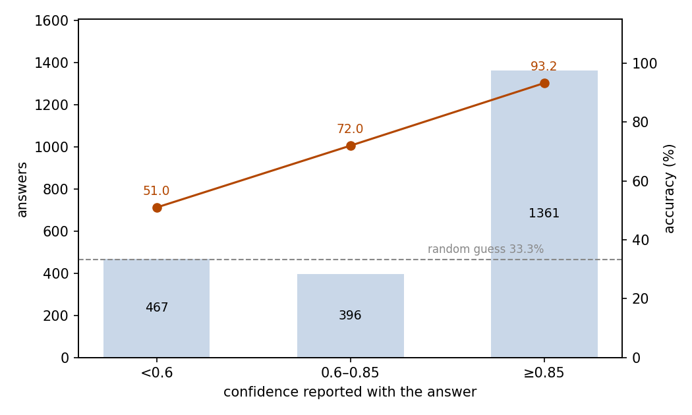
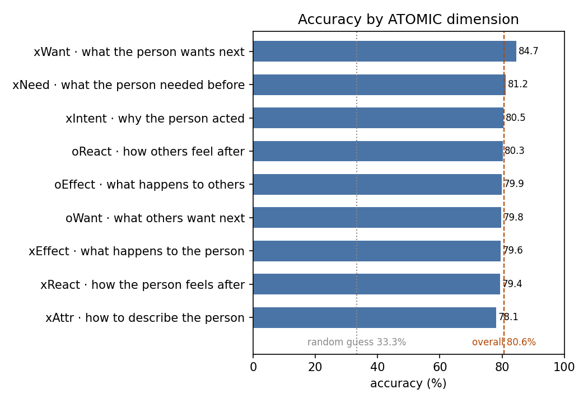

# SocialIQA Social Commonsense: JEV as a Three-Choice Judge

## Abstract

This experiment tests whether JEV can answer questions about everyday social situations. The setting is the full SocialIQA test split: 2,224 questions, each with a short social scenario and three candidate answers. JEV answered 80.58% correctly (95% CI 78.93–82.22%), far above the 33.3% random level, and nearly uniformly across the nine ATOMIC question dimensions (78.11–84.66%). The confidence JEV reports is calibrated and actionable: its mean (0.803) matches actual accuracy, the 61.2% of answers at confidence ≥0.85 are 93.24% correct, and answers below 0.6 drop to 50.96%. The full run consumed 851,327 input tokens and 84,512 output tokens, costing $0.0358 in total. We conclude that JEV handles social commonsense reliably across question types, and that its confidence output can be used directly to route answers.

## 1 Purpose

This experiment asks whether JEV can reason about everyday social situations: what people intend, need, and feel, and what happens to them next. SocialIQA is the standard benchmark for this kind of social commonsense, which is why we chose it. The three-choice format adds a second check: JEV reports a confidence with each answer, and we test whether that confidence tells us when an answer can be trusted.

## 2 Dataset

SocialIQA is an English benchmark for commonsense reasoning about social situations. Each item gives a short context describing an everyday social event, asks a question about it, and offers three candidate answers. We use the official SocialIQA v1.4 release with dimension annotations, pinned as an archive in `preparation/raw/`: its full test split of 2,224 questions.

Each question is posed to JEV as a single-choice question over the dataset's three options, kept in their original order. Correct answers are spread near-evenly over the three positions (720 A, 754 B, 750 C), so position guessing gains nothing.

The release annotates each question with the ATOMIC dimension it probes; these labels ship with the dataset. Six dimensions ask about the central person: why they acted (xIntent), what they needed beforehand (xNeed), how to describe them (xAttr), how they feel afterward (xReact), what happens to them (xEffect), and what they want to do next (xWant). Three ask about the other people involved: how they feel (oReact), what happens to them (oEffect), and what they want to do next (oWant).

## 3 A Minimal Example

This section shows one real question from the dataset with its complete input and output. The input sent to the model (the model field is omitted):

```json
{
  "state": {
    "context": "bailey was a nice person so she called the family together.",
    "question": "What will happen to Others?"
  },
  "questions": {
    "answer": {
      "type": "choice",
      "instructions": "Select the most plausible answer to the question based on the context and everyday social commonsense. Choose exactly one option.",
      "criteria": {
        "A": "talk to the family",
        "B": "hate bailey",
        "C": "thank bailey"
      }
    }
  }
}
```

The model's output (key fields only):

```json
{
  "answers": {
    "answer": {
      "type": "choice",
      "choice": "C",
      "probabilities": {"A": 0.41, "B": 0, "C": 0.59},
      "confidence": 0.38
    }
  },
  "usage": {"input_tokens": 375, "output_tokens": 38, "cost": 0.00001575}
}
```

JEV chose C, the correct answer.

## 4 Results

### Overall

All 2,224 questions received a valid answer; no call failed. Judged against the reference answers provided by the dataset, 1,792 answers are correct: an accuracy of 80.58%, with a 95% confidence interval of 78.93–82.22%. Random guessing over three options scores 33.3%.

### Confidence and accuracy

JEV reports a confidence with each answer (the confidence field, below). Its mean over all answers is 0.803, almost exactly the actual accuracy. Accuracy rises steadily with confidence (Figure 1):

| Confidence | Answers | Share | Accuracy |
| --- | ---: | ---: | ---: |
| < 0.6 | 467 | 21.0% | 50.96% |
| 0.6–0.85 | 396 | 17.8% | 71.97% |
| ≥ 0.85 | 1,361 | 61.2% | 93.24% |



Figure 1: most answers sit at high confidence, and accuracy rises steadily with it; the dashed line marks the 33.3% random level.

### Behavior

Eight answers (0.36%) are internally inconsistent: three carry option probabilities that do not sum to 1, and five select an option other than the highest-probability one. No answer does both; the remaining 2,216 answers are consistent.

### Cost

The run consumed 851,327 input tokens and 84,512 output tokens, for a total cost of $0.0358.

### Results by dimension

Accuracy is nearly uniform across the nine ATOMIC dimensions (Figure 2):

| Dimension | Question asked | Questions | Accuracy |
| --- | --- | ---: | ---: |
| xWant | What the person wants next | 339 | 84.66% |
| xNeed | What the person needed before | 277 | 81.23% |
| xIntent | Why the person acted | 297 | 80.47% |
| oReact | How others feel after | 223 | 80.27% |
| oEffect | What happens to others | 159 | 79.87% |
| oWant | What others want next | 252 | 79.76% |
| xEffect | What happens to the person | 103 | 79.61% |
| xReact | How the person feels after | 277 | 79.42% |
| xAttr | How to describe the person | 297 | 78.11% |



Figure 2: every dimension lands in a narrow band around the overall 80.58%; questions about what the person wants next rank highest, descriptions of the person lowest.

## 5 Conclusion

JEV answers about four in five social commonsense questions correctly, and does so uniformly across all nine question types — there is no weak dimension. The practically useful property is the confidence: calibrated on average, and sharp enough to separate near-certain answers from coin-flips. Accepting only answers at confidence ≥0.85 keeps more than 60% of the questions at above 93% accuracy, and the rest can go to review.

## 6 Insights

1. JEV's social commonsense is even across all nine ATOMIC question types, so social-understanding applications can treat it as one general skill instead of patching individual question types.
2. On this task JEV's confidence needs no calibration: its average matches actual accuracy, so a confidence value can be read directly as expected correctness and used as a routing threshold out of the box.
3. Questions about what a person wants next are the easiest for JEV and attribute-description questions the hardest, so review budgets in social-inference pipelines should cover description-type questions first.
4. A small share of answers are not self-consistent — the chosen option is not always the highest-probability one — so downstream code should recompute the choice from the probabilities instead of trusting the choice field.

## Related Resources

- SocialIQA dataset: https://maartensap.com/social-iqa/
- SocialIQA paper: https://arxiv.org/abs/1904.09728
- ATOMIC paper: https://arxiv.org/abs/1811.00146
