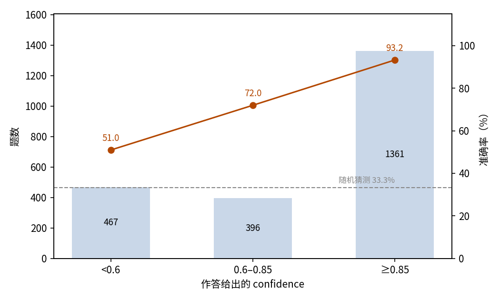
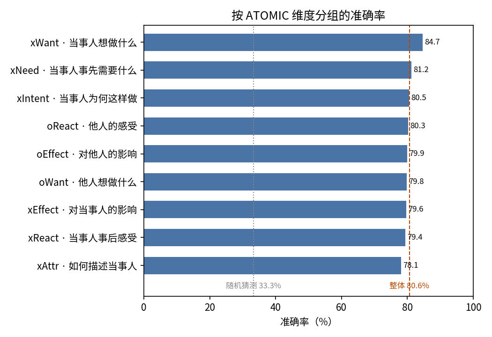

# SocialIQA 社会常识：JEV 三选一作答评估

## 摘要

本实验测试 JEV 回答日常社会情境问题的能力。场景是 SocialIQA 测试集的全部 2,224 题，每题一段社会情境、三个候选答案。JEV 答对 80.58%（95% 置信区间 78.93%–82.22%），远高于 33.3% 的随机水平，且在九个 ATOMIC 维度上近乎均衡（78.11%–84.66%）。JEV 给出的 confidence 校准良好且可用：均值 0.803 与实际准确率几乎持平；confidence 不低于 0.85 的作答占 61.2%，答对 93.24%；低于 0.6 的作答仅答对 50.96%。全部作答消耗输入 851,327 token、输出 84,512 token，总费用 0.0358 美元。结论是 JEV 在各类型社会常识问题上表现稳定，其 confidence 输出可直接用于作答分流。

## 1 实验目的

本实验回答一个问题：JEV 能否推理日常社会情境——人们的意图、需要、感受，以及接下来会发生什么。SocialIQA 是这类社会常识的标准基准，因此被选作测试场景。三选一的作答形式附带一个检验点：JEV 对每题给出 confidence，本实验同时检验这个 confidence 能否用来判断一条作答可不可信。

## 2 数据集

SocialIQA 是英文社会常识推理基准。每题给出一段描述日常社会事件的情境，就该情境提问，并提供三个候选答案。本实验使用官方带维度标注的 SocialIQA v1.4 版本，以压缩包形式钉在 `preparation/raw/`：其测试集的全部 2,224 道题。

每道题以三选一单选的形式发给 JEV，三个选项保持数据集的原始顺序。正确答案在三个位置上分布近乎均匀（A 720 题、B 754 题、C 750 题），靠猜位置没有收益。

该版本为每道题标注了它考察的 ATOMIC 维度，这些标签随数据集自带。六个维度围绕事件当事人：为何这样做（xIntent）、事先需要什么（xNeed）、如何描述当事人（xAttr）、事后感受（xReact）、对当事人的影响（xEffect）、接下来想做什么（xWant）；三个维度围绕在场的他人：他人的感受（oReact）、对他人的影响（oEffect）、他人想做什么（oWant）。

## 3 最小示例

本节取数据集中的一题，展示一次完整的输入与输出。发给模型的输入如下（省略 model 字段；原题为英文，此处译为中文）：

```json
{
  "state": {
    "context": "Bailey 为人友善，所以她把全家人召集到一起。",
    "question": "其他人会发生什么？"
  },
  "questions": {
    "answer": {
      "type": "choice",
      "instructions": "根据情境和日常社会常识，选出该问题最合理的答案。只选一个选项。",
      "criteria": {
        "A": "和家人谈谈",
        "B": "讨厌 Bailey",
        "C": "感谢 Bailey"
      }
    }
  }
}
```

模型输出如下（仅保留关键字段）：

```json
{
  "answers": {
    "answer": {
      "type": "choice",
      "choice": "C",
      "probabilities": {"A": 0.41, "B": 0, "C": 0.59},
      "confidence": 0.38
    }
  },
  "usage": {"input_tokens": 375, "output_tokens": 38, "cost": 0.00001575}
}
```

JEV 选择了 C，即正确答案。

## 4 结果

### 整体结果

2,224 题全部获得有效作答，无失败记录。以数据集提供的标准答案为判据，JEV 答对 1,792 题，准确率 80.58%，95% 置信区间 78.93%–82.22%。三选一随机作答的期望准确率为 33.3%。

### 置信关系

JEV 对每题给出 confidence（下称即该字段）。全部作答的 confidence 均值为 0.803，与实际准确率几乎持平。准确率随 confidence 稳定上升（图 1）：

| confidence | 题数 | 占比 | 准确率 |
| --- | ---: | ---: | ---: |
| < 0.6 | 467 | 21.0% | 50.96% |
| 0.6–0.85 | 396 | 17.8% | 71.97% |
| ≥ 0.85 | 1,361 | 61.2% | 93.24% |



图 1：作答集中在高 confidence 档，准确率随 confidence 稳定上升；虚线为 33.3% 随机水平。

### 行为统计

8 条作答（0.36%）内部不自洽：3 条的选项概率合计不等于 1，5 条所选的选项不是概率最高项；两类互不重叠，其余 2,216 条均自洽。

### 调用成本

本次实验共消耗输入 851,327 token、输出 84,512 token，总费用 0.0358 美元。

### 分维度结果

九个 ATOMIC 维度上的准确率近乎均衡（图 2）：

| 维度 | 所问内容 | 题数 | 准确率 |
| --- | --- | ---: | ---: |
| xWant | 当事人想做什么 | 339 | 84.66% |
| xNeed | 当事人事先需要什么 | 277 | 81.23% |
| xIntent | 当事人为何这样做 | 297 | 80.47% |
| oReact | 他人的感受 | 223 | 80.27% |
| oEffect | 对他人的影响 | 159 | 79.87% |
| oWant | 他人想做什么 | 252 | 79.76% |
| xEffect | 对当事人的影响 | 103 | 79.61% |
| xReact | 当事人事后感受 | 277 | 79.42% |
| xAttr | 如何描述当事人 | 297 | 78.11% |



图 2：各维度都落在整体准确率 80.58% 附近的窄带内；问「当事人想做什么」的题最高，问「如何描述当事人」的题最低。

## 5 结论

JEV 能答对约五分之四的社会常识题，且在九类问题上表现均衡，没有短板维度。最有实用价值的是 confidence：总体均值与准确率持平，且能把近乎全对的作答与近乎猜测的作答分开。只接受 confidence 不低于 0.85 的作答，可保留下超过六成题目且准确率超过九成，其余转交复核即可。

## 6 洞察

1. JEV 的社会常识在九类 ATOMIC 问题上表现均衡，做社交理解应用时可以把它当作一项通用能力，不必按问题类型分别补强。
2. 在这个任务上 JEV 的 confidence 无需校准：均值与实际准确率持平，可直接读作预期正确率，也可直接拿来做分流阈值。
3. 「当事人接下来想做什么」对 JEV 最容易，「如何描述当事人」最难；给社交推理流水线分配复核预算时，应优先覆盖描述类问题。
4. 少量作答并不自洽——所选选项未必是概率最高项——下游应按概率重算选择，而不是直接采信返回的 choice 字段。

## 相关资料

- SocialIQA 数据集：https://maartensap.com/social-iqa/
- SocialIQA 论文：https://arxiv.org/abs/1904.09728
- ATOMIC 论文：https://arxiv.org/abs/1811.00146
